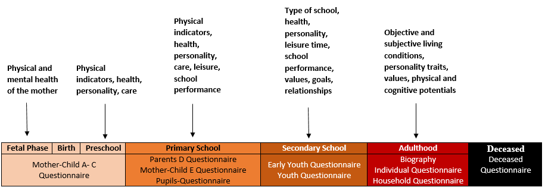

Contents of SOEPcore
********************

The SOEP started in 1984 as a longitudinal survey of private households in the Federal Republic of Germany. The central aim then and now is to collect representative micro-data to measure stability and change in living conditions by following a micro-economic approach enriched with variables from sociology and political science (influenced by the “Social Indicator” movement). Therefore the central survey instruments are a household questionnaire, which is responded by the head of a household and an individual questionnaire, which each household member is intended to answer. Furthermore beginning with 1997, there are wave-specific $LELA files (Lebenslauf - engl. life course) containing the biography information as collected in the respective year.

**Life History**

	
The SOEP questionnaires are designed in such a way that people in a SOEP household can be analysed from birth to adulthood. 
In addition to the :ref:`Youth Questionnaire`, which was conducted for the first time in 2000/01, a series of questionnaires for certain cohorts of children living in SOEP households has been introduced since 2003. These are filled in every year since their year of introduction by mothers (in exceptional cases by fathers) with children of the appropriate age. In 2003 a questionnaire was developed for the mothers of newborn children (0-1 years) :ref:`Mother-Child Questionnaire A`. The following instruments were developed in such a way that this starting cohort (born 2002/ 2003) can be followed up in its development and analysed longitudinally. This was followed in 2005 by a questionnaire for the mothers of 2-3-year-old children :ref:`Mother-Child Questionnaire B` and in 2008 by a questionnaire for 5-6-year-olds :ref:`Mother-Child Questionnaire C`. In 2010, the questionnaire for 7-8-year-old children :ref:`Parents D`, completed by both mothers and fathers, was launched. In 2012, the questionnaire for 9-10-year-old children :ref:`Mother-Child Questionnaire E` was the last questionnaire to be answered by the mothers. This was followed by two youth instruments in which the children, aged 12 :ref:`Pupils Questionnaire` and 14 :ref:`Early Youth Questionnaire` respectively, answered questions about their own life situation for the first time. These were introduced in 2014 and 2016 respectively, so that in 2018 the first cohort went through the complete battery of age-specific instruments for the first time and then, as an adult, will answer annually thematically changing topics of the long-term SOEP study.
As soon as the age of 18 is reached, each person in a SOEP household receives the :ref:`Individual Questionnaire`, the head of the household additionally receives the :ref:`Household Questionnaire`. As soon as a person dies, regardless of whether this person is part of a SOEP household, the :ref:`Deceased Persons Questionnaire` is handed over to the person providing the information.
	
SOEP Topics
===========
	
A rather stable set of core questions is asked every year covering the most essential areas of interest of the SOEP:

Attitudes, Values and Personality
---------------------------------	

The character of a person offers a variety of analysis possibilities. Information about the personality of the respondents, their political orientation, concerns, satisfaction, willingness to take risks and much more can be found in the “Attitudes, Values, and Personality” section.
	
.. figure:: png/attitudes.png
		 :target: https://paneldata.org/soep-core/topics/#topic_dp
		 :align: center

Demography and Population
-------------------------

In this topic you find various information about the birth dates, no matter if interviewer, children, siblings or parents. Furthermore, there is data on places and history of births in households. The household sizes and relationships between the different persons in a household are also listed, as are the	sexes of all persons involved. 

.. figure:: png/demography.png
    :target: https://paneldata.org/soep-core/topics/#topic_dp
    :align: center

Education and Qualification
---------------------------	

Education is one of the cornerstones of our society today, and the information that can be obtained through the SOEP is numerous. Whether school achievement, vocational training or academic success in this section is everything about the education of people. The school history, reasons for lack of further training, educational goals and so on. Furthermore, basic skills of children can be found here to, whether they are able to speak in whole sentences or use scissors, for example.
	
.. figure:: png/education.png
		 :target: https://paneldata.org/soep-core/topics/#topic_dp
		 :align: center	
		 
Family and Social Networks
--------------------------

As a household study, the SOEP determines rich information about family and social contacts and how these relationships change at different stages of life. The whole cycle of life with its wonderful and sad facets and a wide range of information is shown in this section: Pregnancy - birth - parenthood - kinship - circle of friends - marriage - divorce - death. And of course many more data can be found here.

.. figure:: png/family.png
		 :target: https://paneldata.org/soep-core/topics/#topic_dp
		 :align: center	
		 
		 
Home, Amenities and Contributions of Private HH
-----------------------------------------------

In this section you will find information about the household and everything that has to do with everyday life. What kind of home do you live in? Are you an owner or a tenant? Which expenses do you have on things like personal hygiene, the car or holidays? Who’s taking care of the kids? All this and much more information about living, its costs or the living environment can be seen here.

.. figure:: png/home.png
		 :target: https://paneldata.org/soep-core/topics/#topic_dp
		 :align: center		 
		 
Health and Care
---------------

On the subject of health, numerous personal data such as the number of doctoral visits and habits like sport or alcohol consumption are recorded. There are also information on health insurance, health status and grip strength. However, health information from other people such as children or deceased persons are also displayed.

.. figure:: png/health.png
		 :target: https://paneldata.org/soep-core/topics/#topic_dp
		 :align: center			 
	
Integration, Migration, Transnationalization
--------------------------------------------		

Migration and establishment processes are changing society. With its large number of migration samples and specific migration questions, the SOEP can cover these research topics comprehensively. The area “Integration, Migration, Transnationalization” offers you analysis possibilities on migration history, discrimination, interethnic contacts, education, cultural integration, transnational relations, identification with Germany and the intention to stay.	 

.. image:: png/integration.png
		 :target: https://paneldata.org/soep-core/topics/#topic_dp
		 :align: center	
		 
Income, Taxes and Social Security
---------------------------------

Income and finances are an essential part of our everyday life. How much money is earned and how much is spent. Child benefit, pensions, inheritance or salary, but also taxes and debts belong to this topic. No less interesting is the information on other assets such as real estate or property, plant and equipment.

.. figure:: png/income.png		 
		 :target: https://paneldata.org/soep-core/topics/#topic_dp
		 :align: center		

Survey Methodology
------------------		

In the “Survey Methodology” section you will find many relevant variables on imputation, weighting, field work in SOEP core, identifiers, the interviewers’ working methods,survey methods and also information about our respondents’ exit from the survey.

.. image:: png/survey.png
		 :target: https://paneldata.org/soep-core/topics/#topic_dp
		 :align: center	

Time Use and Environmental Behavior
-----------------------------------		

Time is a valuable resource for every human being. Information on how a person plans their time, what obligations they have at what time and how they spend their free time can be found in the “Time Use and Environmental Behavior” section. This section also provides comprehensive information on environmental awareness. Which transport infrastructure is used, which energy resources are used to what extent and what is the position on the subject of renewable energies?	

.. figure:: png/time_use.png
		 :target: https://paneldata.org/soep-core/topics/#topic_dp
		 :align: center		 
	
Work and Employment
-------------------

Information about the topic profession can be found in this section. From the very first job and further training, to job changes and parenthood, to part-time jobs and unemployment. However, not only objective information such as hours of work, but also perceptions of the working environment and feelings about work are shown.

.. figure:: png/work.png
		 :target: https://paneldata.org/soep-core/topics/#topic_dp
		 :align: center

SOEP Questionnaires
===================
		 
.. figure:: png/overview.png
    :align: center		 
		 
		 
.. _Household Questionnaire:

Household Questionnaire
-----------------------

**Availability:** Since 1984 

**Respondent:** Head of household
  
Stable content
++++++++++++++

The household questionnaire has been a standard instrument since the beginning of the SOEP. Because the SOEP has a panel character, important questions have to be answered each year anew by the respondents. In order to enable analyses over time, the household questionnaire therefore has a large number of question modules which are asked every year. The following question modules are part of the core program of the household questionnaire.

.. csv-table::
    :file: csv/stable_content_household.csv
    :header-rows: 1
    :class: longtable
    :widths: 4 5 2 6

:download:`Download Stable Content Household (csv) <csv/stable_content_household.csv>`	

Replication Calendar Household Questionnaire
++++++++++++++++++++++++++++++++++++++++++++

Besides the topics that are asked every year in the household questionnaire, there are some topics modules that are collected irregularly. Many questions do not have to be asked every year as short-term changes are unlikely. In order to be able to react to current social changes, new topics on the household questionnaire are added, which are not surveyed every year and are therefore not part of the standard questions of the household questionnaire. You can find a selection of irregular but recurring topics in the replication calendar:

.. csv-table::
    :file: csv/replication_household.csv
    :header-rows: 1
    :class: longtable
    :widths: 5 5 5 2 6

:download:`Download Replication Household (csv) <csv/replication_household.csv>`	
	
.. _Individual Questionnaire:
   
Individual Questionnaire
------------------------

**Availability:** Since 1984

**Respondent:** Persons over 18 years in the household

Stable content
++++++++++++++

The individual questionnaire has been a standard instrument since the beginning of the SOEP. Because the SOEP has a panel character, important questions have to be answered each year anew by the respondents. In order to enable analyses over time, the individual questionnaire therefore has a large number of question modules which are asked every year. The following question modules are part of the core program of the individual questionnaire.

.. csv-table::
    :file: csv/stable_content_individual.csv
    :header-rows: 1
    :class: longtable
    :widths: 5 5 2 6

:download:`Download Stable Content Individual (csv) <csv/stable_content_individual.csv>`	

Replication Calendar Individual Questionnaire
+++++++++++++++++++++++++++++++++++++++++++++

Besides the topics that are asked every year in the individual questionnaire, there are some topics modules that are collected irregularly. Many questions do not have to be asked every year as short-term changes are unlikely. In order to be able to react to current social changes, new topics on the individual questionnaire are added, which are not surveyed every year and are therefore not part of the standard questions of the individual questionnaire. You can find a selection of irregular but recurring topics in the replication calendar:

.. csv-table::
    :file: csv/replication_individual.csv
    :header-rows: 1
    :class: longtable
    :widths: 5 5 5 2 6
	
:download:`Download Replication Individual (csv) <csv/replication_individual.csv>`	

.. _Biography Questionnaire:

Biography Questionnaire
-----------------------

**Availability:** Since 1987

**Respondent:** Supplementary, one-time data on the personal questionnaire of all persons aged 18 and over in the HH.

**Content:**

- Nationality
- Origin
- Childhood
- Parents
- Life course since the age of 15
- Education
- Occupation
- Partnership/ Marriage
- Information on children
- Siblings

Mother-Child Instruments
------------------------

.. csv-table::
    :header-rows: 1
    :file: csv/themen_muki.csv

.. _Mother-Child Questionnaire A:
	
Mother-Child Questionnaire A (Age 0-1)
++++++++++++++++++++++++++++++++++++++

Mothers of newborn children primarily answer questions about the course of pregnancy, birth, breastfeeding and the health of the newborn child. It also asks to what extent the mother feels that her life circumstances have changed after the birth of the child, how the care of the child is regulated and how the temperament of the baby (as a precursor of the personality) is perceived by mothers.

**Availability:** Since 2003

**Respondent:** Mother in household (child age 0-1)	

**Content:**

- Course of pregnancy
- Childbirth
- Health screening
- Well-being
- Childcare
- Life circumstances	

.. _Mother-Child Questionnaire B:
	
Mother-Child Questionnaire B (Age 2-3)
++++++++++++++++++++++++++++++++++++++

Mothers of 2-3-year-old children also answer some questions about their child's health and how long they have been breastfeeding. In addition, the child's care situation is asked, again the temperament as well as a short scale for recording the personality (agreeableness, extraversion, openness and conscientiousness of the Big Five; McCrae and Costa 1987). In addition, the use of language in the family and activities carried out with the children (e.g. going to the playground, reading or telling stories, visiting other families with children) are recorded. Mothers also assess their children's adaptive behaviour in the dimensions of communication, everyday skills, social relationships and motor skills. The acquisition is based on a translated version of the Vineland Adpative Behavior Scale, which was reduced to 20 items for the SOEP. This scale thus investigates the stage of development of the infant in everyday life. 

**Availability:** Since 2005

**Respondent:** Mother in household (child age 2-3)

**Content:**

- Personality of the child
- Well-being
- Childcare
- Language skills
- Development
- Abilities

.. _Mother-Child Questionnaire C:

Mother-Child Questionnaire C (Age 5-6)
++++++++++++++++++++++++++++++++++++++

The subsequent age-specific survey is carried out as soon as the children turn six years old in the survey year. Among the topics it resembles the surveys conducted in previous years: health, care situation, a more comprehensive battery of items on the personality (from this age neuroticisum is also collected) and activities that are carried out with the child. In addition, there is the Strength and Difficulties Questionnaire (SDQ), which is a shortened version of the German version of the SDQ to 17 items and is a very frequently used instrument for the mental health of children and young people.

**Availability:** Since 2008

**Respondent:** Mother in household (child age 5-6)

**Content:**

- Personality of the child
- Activities with children
- Well-being
- Childcare	

.. _Parents D:

Parents Questionnaire D (Age 7-8)
+++++++++++++++++++++++++++++++++

The questionnaire, which was developed for 7-8-year-old children, is the only age-specific instrument to be completed by both parents, as long as they live together in the same household. In this age range, questions about school attendance (time of school enrolment) and idealistic and realistic educational aspirations become relevant for the first time. However, the focus of this instrument is on the educational goals, parenting styles and the role of both parents. The educational objectives can be differentiated between conformity and autonomy. Educational styles are asked by answering 18 items, which can be divided into six scales: Emotional warmth, inconsistent education, monitoring, negative communication, psychological control, strict control. The items were taken from the pairfam study, as were the 10 items for recording the role of parents. The parental role can be divided into three scales (autonomy, hostile attributes, willingness to make sacrifices). 

**Availability:** Since 2012

**Respondent:** Partents in household (child age 7-8)

**Content:**

- Expectations for school achievments
- Expectations of parental educational goals
- Upbringing
- Parental role
- Childcare

.. _Mother-Child Questionnaire E:

Mother-Child Questionnaire E (Age 9-10)
+++++++++++++++++++++++++++++++++++++++

In addition to the items on health and the care situation recorded in almost all age groups, 9-10-year-old children are asked for more detailed information on the school situation. Here, too, the idealistic and realistic educational aspirations of the mothers for their child are recorded, but also the last grades of the three main subjects, as well as the child's homework supervision and school motivation. Since friends and leisure activities are gaining in importance in this age group, questions are also asked on these topics. Whether and how much pocket money the child receives will be asked for the first time in this age group.

**Availability:** Since 2012

**Respondent:** Mother in household (child age 9-10)

**Content:**

- Expectations (school achievments, parental educational goals)
- Education
- parental commitment
- Leisure activities for children
- Family environment
- Social behavior child
- Personality Child
- Health Child
- Supervision
- Pocket money

Youth Instruments
-----------------

.. csv-table::
   :header-rows: 1
   :file: csv/themen_schueler_jugend.csv  
   
.. _Pupils Questionnaire:   

Pupils Questionnaire
++++++++++++++++++++

In the year in which the children turn twelve, they answer questions about their situation for the first time. Here the focus is once again on the school situation: the start and end of school are asked differentiated according to the days of the week, the type of school attended, the number of pupils in the class and how many of them do not come from Germany, whether one feels discriminated against by the teacher and the last grades in math, German and English. It also determines how much time the student spends on homework, where he or she does the homework and who helps him or her with the homework and learning. The children are asked about their idealistic and realistic graduation aspiration. Since friends play an important role as caregivers at this age, they and various family members are asked what role they play in the support and how often there are disputes. Also asked about the number of close friendships and how often the parents interfere in the choice of friends. The educational aspirations of the three best friends and a maximum of three older siblings (if any) are asked. The cultural capital and learning environment of the pupils are assessed on the basis of various questions (e.g. availability of literature, instruments, art at home; a desk and a room for oneself). Furthermore, the type and frequency of leisure activities is again asked. The student answers whether and how much pocket money he or she receives and for the first time gives information about his or her own personality, willingness to take risks and life satisfaction. The use of the language in the family (only German or other languages) and with whom the meals are usually taken is also asked.

**Availability:** Since 2014

**Respondent:** 11-12-year-olds in the household

**Content:**

- Attitude
- Personality
- School (timetable, school-leaving qualification, Engagement)
- Recreational activities
- Social and family surroundings
- Life circumstances

.. _Early Youth Questionnaire:

Early Youth Questionnaire
+++++++++++++++++++++++++

The questionnaire for early youth is largely similar to the questionnaire for pupils in order to provide an appropriate data structure for questions relevant to developmental psychology. Fewer questions are asked about homework and the learning environment, but the question is asked whether the young person is involved in the school (e.g. as class spokesperson or in a working group) and social capital is acquired in this way. The current importance of various family members and friends is asked and, in addition to their own educational aspirations, also that of the three best friends. With regard to parents, the question is asked how long the young person is allowed to travel and stay up alone before school days and what things the 14-year-old has already done without parents (e.g. holidays, going to the doctor, exchanging something in the shop, drinking alcohol, smoking cigarettes). They ask again for the pocket money and also whether the young person has the opportunity to save money. Another new topic in this age group is the interest in politics and the inclination towards a certain party.

**Availability:** Since 2015

**Respondent:** 13-14-year-olds in the household

**Content:**

- self-perception
- School (timetable, school-leaving qualification, Engagement)
- Recreational activities
- Friends
- Siblings
- Parents
- Pocket money
- Party preferences
- Self-Perception
- Willingness to take risks
- Life satisfaction
- Attitudes/Opinions
- Future

.. _Youth Questionnaire:

Youth Questionnaire
+++++++++++++++++++

In the SOEP, people who turn 17 in the corresponding survey year are considered adult respondents. Like other first-time adult participants, you will thus receive a CV and a individual questionnaire. Since part of the adult biography (such as the employment biography or the relationship biography) does not yet apply to the young participants and other aspects such as the relationship with parents, leisure activities, the school situation or vocational training play a greater role, a youth questionnaire was developed in 2000 which replaces the CV questionnaire in this age group and has been used since then. The content of this questionnaire corresponds in many respects to the adult CV questionnaire, so that the data can be used to supplement the information  on parents (if they do not live in the household; data set: BIOPAREN). Health status, personality, willingness to take risks, locus of control, trust, time preference, political preferences, knowledge of German as well as information on the living situation, work situation, training, career plans and educational aspirations are also surveyed. For the period from 2000 to 2005, the youth questionnaire was surveyed in addition to the personal questionnaire. Since 2006, only the youth questionnaire has been recorded for 17-year-olds. Since then, it has been available in a version extended by a few indicators, and instead a test has been used to assess cognitive potential. Based on the I-S-T 2000R (Amthauer et al. 2001) the components analogies, number series and matrices with 20 subtasks each were selected for the SOEP (cf. Solga et al. 2005). With the help of these tasks, the fluid cognitive abilities are to be recorded. This is a strongly biologically determined dimension of cognitive abilities that is not influenced by education and is primarily based on reasoning, processing rate and working memory capacity (Cattell 1971; Horn 1982). Although the format of the test differs from the usual questionnaires in surveys, the willingness of young people to participate is high (Schupp and Hermann 2009). 

**Availability:** Since 2000

**Respondent:** 16-17 year olds in the household

**Content:**

- Living
- Relationships
- Leisure and Sport
- School (Graduation, Foreign languages, Engagement)
- Pocket money
- Education
- Career Plans
- Future
- Origin
- Childhood and Parental Home
- Attitudes/Opinions
- Self-Perception
- Life satisfaction
- Party preferences   

„Lust auf DJ“ (Denksport und Jugend) Questionnaire
++++++++++++++++++++++++++++++++++++++++++++++++++

In SOEP 2006, a separate questionnaire with cognitive tests for adolescents was used for the first time: “Lust auf DJ”. In this case, “DJ” stands for “Thinking Sports and Youth (Denksport und Jugend)”, but was also specifically selected to arouse the more common association of “Disc Jockey”. For all interviewees aged 16 - 17 years, the questionnaire “Lust auf DJ” was used and created.

**Availability:** Since 2007

**Respondent:** 16-17-year-olds in the household as a supplement to the youth questionnaire

**Content:**

- Assignment of word pairs
- Complete incomplete equations
- Assign figures

Additional Instruments
----------------------

„Lücke“ Questionnaire - Re-questioning of the Individual Questionnaire (Summary)
++++++++++++++++++++++++++++++++++++++++++++++++++++++++++++++++++++++++++++++++

The "Lücke" (english:gap) questionnaire relates to temporary drop outs for which significant missing data from the previous year are collected. 

**Availability:** Since 1987

**Respondent:** SOEP respondents who are temporarily unavailable.

**Content:**

All data refer to the previous survey year 

- Status of the respondent
- Occupational change
- Receipt of social benefits within the last year
- Completion of education
- Type of educational attainment
- Change of family status

.. _Deceased Persons Questionnaire:

Deceased Persons Questionnaire
++++++++++++++++++++++++++++++

For the first time in the main wave of 2009, information should be collected on former SOEP participants who have died since the survey in 2008 or until the time of the survey in 2009. Through the questionnaire "The deceased person", the SOEP curriculum vitae principle is thus consistently "completed". The primary aim of the chosen concept is to obtain as much information as possible about the death circumstances of former SOEP participants. However, it also generates information about people who have never participated in the SOEP survey. The information collected in this way about otherwise "unknown" persons, however, can also be used for various analysis purposes on causes of death and the context of death can also be used in the socio-scientific analysis.

**Availability:** Since 2009

**Respondent:** SOEP respondents who lost a loved one.

**Content:**

- Relationship to the deceased
- Deceased part of the survey?
- Domestic environment of the deceased person 
- Cause and place of death
- Legacies
- Health condition of the deceased
- Life satisfaction of the deceased
- Influence of loss on one's own life

Gripping Strength Test
++++++++++++++++++++++

**Availability:** Since 2008

**Respondent:** Persons over 17 years in the household

**Content:**

This test measures the strength a person can exert when gripping. This can be important for assessing the physical condition.

IAB-SOEP-Migrationsstichprobe
-----------------------------

Personal Biography Questionnaire (New Respondents)
++++++++++++++++++++++++++++++++++++++++++++++++++

**Availability:** Since 2014

**Respondent:** Persons with a migrant background aged 18 and over in the household

**Content:**

- Citizenship
- Origin
- Knowledge/Skills before entering 
- Migration background
- Migration biography (the way to Germany)
- Current living situation
- Childhood and Parental Home
- Life course since the age of 15
- Education/Degrees
- Family Situation
- Partnership situation before immigration
- Employment (current and past)
- Occupational Change
- Current income
- Education/further training
- Earnings
- Well-being
- Attitudes/Opinions

Individual Questionnaire (Reinterviewed)
++++++++++++++++++++++++++++++++++++++++

**Availability:** Since 2014

**Respondent:** Persons with a migrant background aged 18 and over in the household

**Content:**

Like :ref:`Individual Questionnaire` + the following migration-specific topics:

- Training/further training at home and abroad 
- Discrimination/Pursuit/War
- Employment before moving to Germany
- Amount of income in local currency
- Religious community
- Immigration parents and/or grandparents + place

Youth Questionnaire
+++++++++++++++++++

**Availability:** Since 2014

**Respondent:** 16-17 year olds in household with a migration background

**Content:**

Like :ref:`Biography Questionnaire`  + the following migration-specific topics:

- Circle of friends
- Degree at home or abroad
- German lessons as a foreign language
- Training at home or abroad
- Year of the parents' immigration
- Acquired degree of parents at home or abroad 
- Religious community

Household Questionnaire
+++++++++++++++++++++++

**Availability:** Since 2014

**Respondent:** Head of household

**Content:**

Like :ref:`Household Questionnaire` + the following migration-specific topics:

- Valuables in Germany or abroad

IAB-BAMF-SOEP-Befragung von Geflüchteten
----------------------------------------

Personal Biography Questionnaire (New Respondents)
++++++++++++++++++++++++++++++++++++++++++++++++++

In 2017 (second wave of surveys), the survey instruments used and the respective survey content will come closer to the SOEP standard. In addition to the personal and household questionnaire, age-specific children's instruments are used. As a rule, mothers of children of specific birth cohorts living in households (2016/2017, 2014, 2011, 2009, 2007) are asked about their educational participation in Germany, as well as information which includes the SOEP standard of the mother-child survey instruments and refugee specific additions, such as educational pathways before fleeing to Germany, language acquisition and mental illness.  In addition, with the consent of the parents, specific birth cohorts (2005, 2003 and 2000) of the growing up children/young people in the participating fugitive households themselves are interviewed. The age-specific SOEP standard instruments (students, early youth and youth) also serve as a model here. In addition to specific extensions for the fugitives, the adolescents undergo a test of basic cognitive skills developed by the Institute for Quality Development in Education (IQB). The selection of questions in the personal questionnaire, which is aimed at all adult refugees, should make it possible to trace the course of integration in many areas, also in comparison to other population groups. Thus, topics specific to refugees in the first wave of the survey are updated, such as the current status of the asylum procedure or language course participation. Classic SOEP topics, such as questions about current employment, will be given more scope. Flight-specific innovations that have become established in recent immigrant samples (IAB-SOEP Migration Surveys M1 and M2 from 2013 and 2015), such as the recording of educational qualifications acquired abroad with the help of the CAMCES tool and the question module on the recognition of qualifications acquired abroad, will also be used in the personal questionnaire in 2017.

**Availability:** Since 2017

**Respondent:** Refugees over 18 years of age

**Content:**

- Origin and route to Germany
- Escape/Travel Reasons
- Flight/Travel expenses
- Escape/route
- Accommodation in Germany
- Reasons why Germany as a target country
- Status of the asylum procedure
- Residence permit
- Satisfaction on various aspects
- Intention to stay
- Writing and language skills (mother tongue and foreign language)
- Integration courses in Germany
- Awareness, need and use of support and consulting services
- Employment and income abroad and in Germany 
- Life situation before arrival
- Schools, colleges and vocational training abroad and in Germany (+ recognition)
- Curriculum vitae from age 15
- Well-being
- Perception of life
- Attitude towards the future
- Religious community
- party preferences
- Assessment of the current situation in the country of origin
- Attitude and values
- Personality
- Social Networks
- Family situation
- Participation of children in education
- Declaration of consent for register linking

