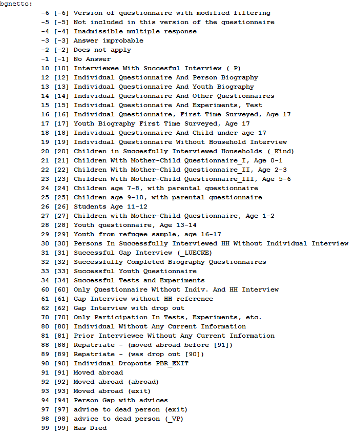
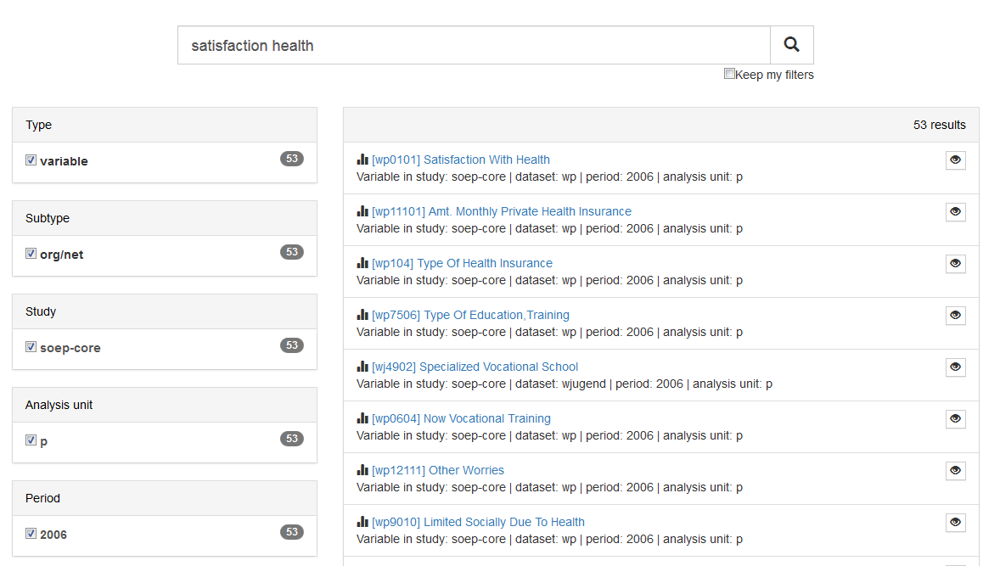
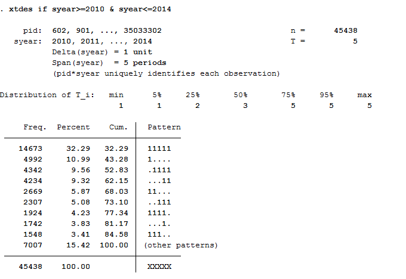
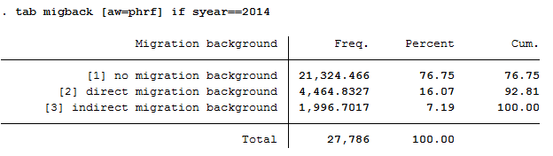
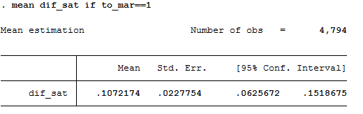
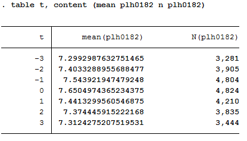
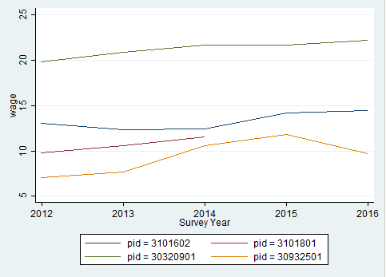
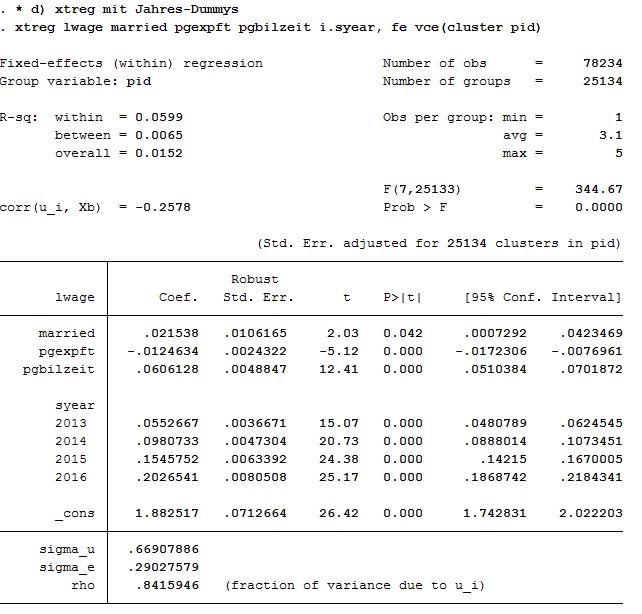

Working with SOEP Data
**********************

.. _working_ppfad:

Working with Tracking Data (PPFAD)
==================================

For all years since 1984, the PPFAD data set contains information on all persons who have ever lived in a SOEP household at a survey time (i.e. all respondents, but also children under 17 years of age and persons who have never given an interview). PPFAD is important for the distinction of the research units (persons), especially for longitudinal analyses. In addition, paneldata.org uses PPFAD to differentiate the study population. 

**Time constant information of persons:**

- Never changing Person ID (adults, adolescents, children)
- Original Household Number
- Gender, year of birth, month of birth, year of death if applicable
- Migrant Background
- Sample Membership (psample)

**Time-varying information from people:**

- Current Household Number: If you move to another household, the household number changes (hhnrakt or $hhnr)
- Survey Status ($netto, $netold)
- Population Membership (private household, institutional households)
- Survey Region (East or West Germany)

The data set is explained in more detail in a documentation:

`Dokumentation PPFAD <http://www.diw.de/documents/publikationen/73/diw_01.c.581313.de/diw_ssp0487.pdf>`_:

**Create an exercise path with four subfolders:**

.. figure:: png/uebungspfade.PNG
    :align: center    

**Example:** 

- H:/material/exercises/do
- H:/material/exercises/output
- H:/material/exercises/temp
- H:/material/exercises/log

These are used to store your script, log files, datasets and temporary datasets. Open an empty do file and define your created paths with globals:

.. literalinclude:: docs/Arbeit_ppfad.do
   :linenos:
   :lines: 8-16

The global „AVZ“ defines the main path. The main paths are subdivided using the globals "MY_IN_PATH", "MY_DO_FILES", "MY_LOG_OUT", "MY_OUT_DATA", "MY_OUT_TEMP". The global "MY_IN_PATH" contains the path to your ordered data.

**Based on the data in PPFAD, answer the following questions:**

**1. Look at the two people with the person ID (variable persnr) 2102 and 19202**

**a) What gender are they? When were they born and possibly died?**

Open the PPFAD dataset. Search the data set for variables that describe gender, year of birth and year of death. Display the information of the variables for persons 2102 and 19202.

.. literalinclude:: docs/Arbeit_ppfad.do
   :linenos:
   :lines: 25-28

.. figure:: png/aufgabe_1.a.PNG
    :align: center

**b) Were these people and their parents born in Germany?**

In the data set, search for a variable that describes the migration background.
Display the information of the variable for persons 2102 and 19202.

.. literalinclude:: docs/Arbeit_ppfad.do
   :linenos:
   :lines: 30-31
   

**c) If they have immigrated: In which year and from which country?**

Search the data set for a variable that describes the country of birth and the year of moving to Germany. Display the information of the variables for persons 2102 and 19202.

.. literalinclude:: docs/Arbeit_ppfad.do
   :linenos:
   :lines: 33-34

.. figure:: png/aufgabe_1.c.PNG
    :align: center

**d) Are these people from East or West Germany?**

Search the data set for a variable that describes east-west affiliation.
Display the information of the variables for persons 2102 and 19202.

.. literalinclude:: docs/Arbeit_ppfad.do
   :linenos:
   :lines: 36-37

.. figure:: png/aufgabe_1.d.PNG
    :align: center  

**e) From which sources does the information on the migration background and the year of death come?**

Search the data set for info variables that show you sources of information for the year of death and the migration background. Display the information of the variables for persons 2102 and 19202.

.. literalinclude:: docs/Arbeit_ppfad.do
   :linenos:
   :lines: 39-40

**2. How many people lived in a realised private household in 2016 and answered the individual questionnaire?**

Remember that the wave-specific survey year in SOEP is abbreviated with letters. SOEP started in 1984 (wave a) and was in a survey wave "bg" in 2016. For more information on this topic, please refer to the DTC subchapter :ref:`Label`. 

If you are interested in the 2016 survey year, the wave name indicates that you should be interested in variables with the abbreviation "bg".
Search the data set for variables with the abbreviation "bg" that describe the population. Display the characteristics of the population variables:

.. literalinclude:: docs/Arbeit_ppfad.do
   :linenos:
   :lines: 43-55

.. figure:: png/aufgabe_2_1.PNG
    :align: center  	

Values 1 and 2 are relevant to answer the question because they describe realized households. Search the data set for variables with the abbreviation "bg" that describe the survey status. Display the characteristics of the survey status:

.. literalinclude:: docs/Arbeit_ppfad.do
   :linenos:
   :lines: 56

.. figure:: png/aufgabe_2_2.PNG
    :align: center 

Respondents with survey status between 10 and 15 or survey status 19 completed the individual questionnaire. Cross-tab the variables bgpop and bgnetto with an appropriate restricting condition to answer the question.

.. literalinclude:: docs/Arbeit_ppfad.do
   :linenos:
   :lines: 57

.. figure:: png/aufgabe_2_3.PNG
    :align: center  

**3. PPFAD allows you to see which populations can be viewed from a longitudinal perspective:**

**a) How many people who answered the individual questionnaire in 2000 also took part in the survey in 2014?**

Remember that the wave-specific survey year in SOEP is abbreviated with letters. SOEP started in 1984 (wave a) and was in a survey wave "bg" in 2016. For more information on the subject, see the subchapter :ref:`Label`. 
The wave name shows that you are interested in the survey years 2000 and 2014. The survey years include the wave names "q"(2000) and "be"(2014). Search the data set for variables with the abbreviations "q" and "be" that describe the survey status. Display the characteristics of the survey status under the condition that the individual questionnaire has been answered:

.. literalinclude:: docs/Arbeit_ppfad.do
   :linenos:
   :lines: 71-81

.. figure:: png/aufgabe_3_a.PNG
    :align: center	

A total of 7639 respondents completed the individual questionnaire in 2000 and 2014.

**b) How many people answered the individual questionnaire every year from 2000 to 2014?**

The survey years include the wave designations from "q"(2000) to "be"(2014).
View the relevant survey status codes to answer the question. Please consider all persons who have answered the individual questionnaire:

.. literalinclude:: docs/Arbeit_ppfad.do
   :linenos:
   :lines: 100-104

Define a variable list that shows all survey statuses ($netto) of the 15 survey waves considered in total.

.. literalinclude:: docs/Arbeit_ppfad.do
   :linenos:
   :lines: 106-108
   
Generate a variable that shows the number of waves of completed person interviews. Note that the values 10,12,13,14,15,16,18,19 of the $netto variable mean realized interviews.

.. literalinclude:: docs/Arbeit_ppfad.do
   :linenos:
   :lines: 110-111

Display a table with its newly generated variable.

.. literalinclude:: docs/Arbeit_ppfad.do
   :linenos:
   :lines: 113

.. figure:: png/aufgabe_3_b4.PNG
    :align: center  

A total of 6665 people completed the individual questionnaire every year over the period 2000-2014. 

**c) How many people who turned 15 in 2011 and lived as children in a survey household took part in the survey in 2016?**

The survey year 2011 is represented by the wave "bb" and the survey year 2016 is represented by the wave "bg". To answer the question, a variable must be generated that identifies people who were 15 years old in 2011. The age of the respondent can be determined with the year of birth and you can limit children using the net code. Generate a variable with people who turned 15 in 2011 and lived in a survey household as a child.

.. literalinclude:: docs/Arbeit_ppfad.do
   :linenos:
   :lines: 118-131

In order to identify all persons who were 15 years old in 2011, lived in a survey household as a child and completed the individual questionnaire in 2016, you must use the net codes again. Create a table from the net code of 2016 to narrow down the cases appropriately.

.. literalinclude:: docs/Arbeit_ppfad.do
   :linenos:
   :lines: 133-136

.. figure:: png/aufgabe_3_c2.PNG
    :align: center  

In 2016, a total of 309 people who were 15 years old and were part of a survey household as a child in 2011, completed a individual interview.

**d) The person with persnr=588010 was born in 1984 in a panel household and was still part of the sample in 2009. The person has changed households twice during this time. In which years?**

To identify how often and when a person has changed the household, you must display all available household numbers in ppfad for person 588010. 

.. literalinclude:: docs/Arbeit_ppfad.do
   :linenos:
   :lines: 142-153

.. figure:: png/aufgabe_3_d.PNG
    :align: center

The person 588010 has participated in the survey since the wave "b" (1985) in household 58807. From wave "d" (1987) to wave "x" (2007) the person was in household 73407, from wave "y" (2008) the person was in household 132608. 

.. _cross_data:

Generating a cross-section Data Set
===================================

.. |ynetto ppfad| raw:: html

   <a href="https://paneldata.org/soep-core/data/ppfad/ynetto" target="_blank">"ynetto"</a>

.. |ynetto ppfad2| raw:: latex

   \href{https://paneldata.org/soep-core/data/ppfad/ynetto}{\textbf{"ynetto"}}     
   

This example involves generating a data set to analyze health satisfaction determinants in 2008, and you can either use the Paneldata.org syntax generator or write your own syntax file to perform this task. You can search for the variable names in Paneldata.org (or use the variables below directly).

**1. Generate a cross-section dataset for the year 2008, which should contain all persons with the following characteristics:**

- Respondents in 2008 |ynetto ppfad| |ynetto ppfad2|
- Lives 2008 in private household |ypop ppfad| |ypop ppfad2|

The data set should contain the following variables of interest. 

- Satisfaction with health |yp0101 yp| |yp0101 yp2|
- Smoking currently yes/no |yp10601 yp| |yp10601 yp2|
- current employment status |emplst08 ypgen| |emplst08 ypgen2|
- monthly household net income |hinc08 yhgen| |hinc08 yhgen2|

In addition, the data set should contain the following additional information for a 2008 cross-sectional analysis (these variables are automatically generated by paneldata.org):

- Current cross-section weighting factor |yphrf phrf| |yphrf phrf2|
- Personal number |persnr ppfad| |persnr ppfad2|
- Original household number |hhnr ppfad| |hhnr ppfad2|
- Current household number |yhhnr ppfad| |yhhnr ppfad2|
- Sample affiliation |psample ppfad| |psample ppfad2|
- Gender |sex ppfad| |sex ppfad2|
- Year of birth |gebjahr ppfad| |gebjahr ppfad2|

**Create an exercise path with four subfolders:** 

.. figure:: png/uebungspfade.PNG
    :align: center

**Example:** 

- H:/material/exercises/do
- H:/material/exercises/output
- H:/material/exercises/temp
- H:/material/exercises/log

These are used to store commands, log files, data sets and temporary data sets. 
Open an empty do file and define your created paths with globals:

.. literalinclude:: docs/Arbeit_ppfad.do
   :linenos:
   :lines: 8-16

The global „AVZ“ defines the main path. The main paths are subdivided using the globals "MY_IN_PATH", "MY_DO_FILES", "MY_LOG_OUT", "MY_OUT_DATA", "MY_OUT_TEMP". The global "MY_IN_PATH" contains the path to your ordered data.

Use ppfad as the source file together with the required variables. Keep all cases with completed interviews. In addition, your data set should only contain respondents who can make a statement on the content of the question. For example, you can use the net code to identify and remove children from your data set. 

.. literalinclude:: docs/querschnitt_data.do
   :linenos:
   :lines: 25-44

Save the modified data record temporarily. 
Now link your data set with the weights of the SOEP and save your data set as a master file. 

.. literalinclude:: docs/querschnitt_data.do
   :linenos:
   :lines: 47-63
	
Now prepare the content variables. Search for the content variables you are looking for from the various data records and temporarily save the created data records.

.. literalinclude:: docs/querschnitt_data.do
   :linenos:
   :lines: 66-83
	
Link your created data sets to your masterfile and save your analysis data set. 

.. literalinclude:: docs/querschnitt_data.do
   :linenos:
   :lines: 86-109

You have successfully created a cross-sectional data set for the year 2008.	

**2. Encode missing values into missing values in system failings (STATA)!**

In SOEP the missing codes of variables are described in detail with the values -1 to -8. To learn more about missing codes, see the chapter :ref:`missings`. For content analyses it is not always necessary to differentiate missing codes. Therefore you should be able to convert missing codes:

.. literalinclude:: docs/querschnitt_output.do
   :linenos:
   :lines: 13-22
	
Open your analysis data set and summarize all missing codes.

**3. How does average health satisfaction differ**
**a) by sex**

Satisfaction was measured on a scale of 10. To compare the average satisfaction with health between women and men, you should display the mean value for both sexes.

.. literalinclude:: docs/querschnitt_output.do
   :linenos:
   :lines: 32-33

.. figure:: png/quer_06.PNG	
    :align: center	
	
Since you have previously added the SOEP weighting factors to your analysis data set, you should use the weighting for a representative analysis.

.. literalinclude:: docs/querschnitt_output.do
   :linenos:
   :lines: 34-35

.. figure:: png/quer_07.PNG	
    :align: center	

**b) Employment status**

Now proceed in a similar way when comparing satisfaction with health and employment status. Compare the mean values again:

.. literalinclude:: docs/querschnitt_output.do
   :linenos:
   :lines: 37-39

.. figure:: png/quer_08.PNG	
    :align: center	

Since you have previously added the SOEP weighting factors to your analysis data set, you should use the weighting for a representative analysis.

.. literalinclude:: docs/querschnitt_output.do
   :linenos:
   :lines: 40-41

**c) Age** 

Since you do not have a variable that represents the age, you must generate a suitable age variable using the Birth year variable. The year of birth is metric and should be categorized for analysis. Define categories for your age variable and assign suitable labels.

.. literalinclude:: docs/querschnitt_output.do
   :linenos:
   :lines: 43-49

Create a mean value comparison with your age variable and health satisfaction in weighted and unweighted form.

.. literalinclude:: docs/querschnitt_output.do
   :linenos:
   :lines: 51-52

.. literalinclude:: docs/querschnitt_output.do
   :linenos:
   :lines: 53-54
   
.. figure:: png/quer_12.PNG
    :align: center	

**d) Income**

As with age, generate a categorized version of the income for the household net income:

.. literalinclude:: docs/querschnitt_output.do
   :linenos:
   :lines: 56-60

Display the mean values in weighted and unweighted form:

.. literalinclude:: docs/querschnitt_output.do
   :linenos:
   :lines: 62-63
   
.. figure:: png/quer_14.PNG
    :align: center	

.. literalinclude:: docs/querschnitt_output.do
   :linenos:
   :lines: 64-65
   
.. figure:: png/quer_15.PNG
    :align: center	

**e) Smoking**

Since this variable is nominal, adjustments to this variable are not necessary. Display the average satisfaction with health for smokers and non-smokers in weighted and unweighted form:

.. literalinclude:: docs/querschnitt_output.do
   :linenos:
   :lines: 67-70

.. figure:: png/quer_16.PNG
    :align: center	

.. literalinclude:: docs/querschnitt_output.do
   :linenos:
   :lines: 72-73
	

Working with Migration Data (BIOIMMIG)
======================================

.. |migback ppfad| raw:: html

   <a href="https://paneldata.org/soep-core/data/ppfad/migback" target="_blank">"migback"</a>
   
.. |migback ppfad2| raw:: latex

   \href{https://paneldata.org/soep-core/data/ppfad/migback}{\textbf{"migback"}}    

.. |germborn ppfad| raw:: html

   <a href="https://paneldata.org/soep-core/data/ppfad/germborn" target="_blank">"germborn"</a>
   
.. |germborn ppfad2| raw:: latex

   \href{https://paneldata.org/soep-core/data/ppfad/germborn}{\textbf{"germborn"}} 
   
.. |corigin ppfad| raw:: html

   <a href="https://paneldata.org/soep-core/data/ppfad/corigin" target="_blank">"corigin"</a>
   
.. |corigin ppfad2| raw:: latex

   \href{https://paneldata.org/soep-core/data/ppfad/corigin}{\textbf{"corigin"}}   

.. |immiyear ppfad| raw:: html

   <a href="https://paneldata.org/soep-core/data/ppfad/immiyear" target="_blank">"immiyear"</a> 

.. |immiyear ppfad2| raw:: latex

   \href{https://paneldata.org/soep-core/data/ppfad/immiyear}{\textbf{"immiyear"}}   
   
With its migration and refugee samples, SOEP provides a broad spectrum of information on persons with a refugee and migration background. 

In the BIOIMMIG data set you will find relevant information on the history of flight and migration, such as motives for fleeing and migration, the circumstances after arrival in Germany, but also information on relatives in the country of origin and the desire to return to the country of origin in edited form. For more information about this data set and a list of the variables it contains, see the 
`BIOIMMIG Documentation <http://panel.gsoep.de/soep-docs/surveypapers/diw_ssp0418.pdf#page=214>`_.

In the following, we will use this record and other information from the SOEP to create a status variable that you can use to distinguish whether or not people with a migration background also have an escape background. 

**Create an exercise path with four subfolders:**

.. figure:: png/uebungspfade.PNG
    :align: center    

**Example:** 

- H:/material/exercises/do
- H:/material/exercises/output
- H:/material/exercises/temp
- H:/material/exercises/log

These are used to store commands, log files, data sets and temporary data sets. 
Open an empty do file and define your created paths with globals:

.. literalinclude:: docs/Arbeit_ppfad.do
   :linenos:
   :lines: 8-16

The global „AVZ“ defines the main path. The main paths are subdivided using the globals "MY_IN_PATH", "MY_DO_FILES", "MY_LOG_OUT", "MY_OUT_DATA", "MY_OUT_TEMP". The global "MY_IN_PATH" contains the path to your ordered data.

**Task 1: Preparation of BIOIMMIG**

**a) In which variable can you find information about the status of each person when they immigrated to Germany?** 

Open the record or browse the `BIOIMMIG documentation <http://panel.gsoep.de/soep-docs/surveypapers/diw_ssp0418.pdf#page=214>`_ and search for a variable describing the immigration status. The biimgrp variable from the BIOIMMIG data set is the appropriate variable.

.. literalinclude:: docs/SOEPcampus_Migration_Solution.do
   :linenos:
   :lines: 22-30

**b) Identify this variable in the BIOIMMIG data set and load it from the data set, together with the person number and the survey year.**  
   
Open your data set only with the required variables to maintain clarity in your analysis data set. 
   
.. literalinclude:: docs/SOEPcampus_Migration_Solution.do
   :linenos:
   :lines: 32-36

**c) What are the values of this variable?**

Familiarize yourself with your research-relevant analysis variable and check coding and case numbers.

.. literalinclude:: docs/SOEPcampus_Migration_Solution.do
   :linenos:
   :lines: 38-42

**d) On the basis of this variable, generate the variable "Escape", which only distinguishes between three groups:**

- 0 = Cases where no information is available
- 1 = All persons without escape background 
- 2 = Asylum seekers / fugitives

After you have familiarized yourself with the research-relevant analysis variable, recode the variable to suit your project. Then check the case numbers of your generated variable with the source variable.

.. literalinclude:: docs/SOEPcampus_Migration_Solution.do
   :linenos:
   :lines: 60-68

**e) It may happen that initially there is no information on the status of immigration, but this will change in a later year. Limit the data record to the last observation that is available for the respective person, since this way the specification with the most information content is used.** 

.. literalinclude:: docs/SOEPcampus_Migration_Solution.do
   :linenos:
   :lines: 90-97
   
**f) Save the generated data record on your personal drive temporarily .** 

.. literalinclude:: docs/SOEPcampus_Migration_Solution.do
   :linenos:
   :lines: 101-104

**Aufgabe 2: Add basic variables from PPFAD and weights** 

**a) Load the following information from PPFAD:** 

- Never changing Person ID |persnr ppfad| |persnr ppfad2|
- Household number |hhnr ppfad| |hhnr ppfad2| and the current household number |bghhnr ppfad| |bghhnr ppfad2| 
- The net variable with information about the interview type |bgnetto ppfad| |bgnetto ppfad2|
- The sex of the person |sex ppfad| |sex ppfad2|
- The year of birth |gebjahr ppfad| |gebjahr ppfad2|
- Variables on the migration background |migback ppfad| |migback ppfad2|, |germborn ppfad| |germborn ppfad2|, |corigin ppfad| |corigin ppfad2|, |immiyear ppfad| |immiyear ppfad2|
- Information about the survey status: |psample ppfad| |psample ppfad2|

If you want to familiarize yourself with the PPFAD data set, visit the chapter :ref:`working_ppfad`.

.. literalinclude:: docs/SOEPcampus_Migration_Solution.do
   :linenos:
   :lines: 108-119

**b)  Merge the previously generated data record using the person number.** 

If you don't understand how to create your own cross-section dataset, visit the chapter :ref:`cross_data`.

.. literalinclude:: docs/SOEPcampus_Migration_Solution.do
   :linenos:
   :lines: 121-125
   
**c) Add the corresponding person extrapolation factors to the data record.**

.. literalinclude:: docs/SOEPcampus_Migration_Solution.do
   :linenos:
   :lines: 128-131
   
**d) Only keep respondents for whom a youth or individual questionnaire was realized in 2016.** 

For example, to exclude children who have not provided immigration status information, use the net code from PPFAD. Only keep persons who have conducted a completed individual or youth interview. 

.. literalinclude:: docs/SOEPcampus_Migration_Solution.do
   :linenos:
   :lines: 133-139
   
.. figure:: png/mig_3.PNG
    :align: center    

**Task 3: Generate a status variable with the following categories:**.

- No immigrant background
- Migration 2nd generation
- Immigration without information
- Immigration, not flight
- Immigration, Flight

To generate this status variable, check the contents of the existing migration variables from PPFAD (migback germborn).

.. literalinclude:: docs/SOEPcampus_Migration_Solution.do
   :linenos:
   :lines: 143-147

.. literalinclude:: docs/SOEPcampus_Migration_Solution.do
   :linenos:
   :lines: 149
   
.. figure:: png/mig_5.PNG
    :align: center      
	
Use the migration variables from PPFAD (migback, germborn) and link this information with your previously generated escape variable to build the described status variable from Task 3. 

.. literalinclude:: docs/SOEPcampus_Migration_Solution.do
   :linenos:
   :lines: 151-159
 
**Task 4: Content analysis:**	

**a) How many refugees (foreign-born with refugee/asylum titles) are now in your record?**

Look at your status variable previously generated in task 3 to answer the question

.. literalinclude:: docs/SOEPcampus_Migration_Solution.do
   :linenos:
   :lines: 161-167

.. figure:: png/mig_6.PNG
    :align: center  

All 4,514 respondents who received the value 5 for the generated status variable have a direct migration background (migback==2), were not born in Germany (germborn==2) and fled their home country (flight==2 and biimgrp==5).

**b) How many are there if you take the person extrapolation factors into account? Interpret the results.**

Look at your status variable previously generated in task 3 to answer the question

.. literalinclude:: docs/SOEPcampus_Migration_Solution.do
   :linenos:
   :lines: 186-190
   

After weighting, there are only about 675 fugitives in the data set.
The weighting thus corrected the number of fugitives downwards.

**c) How many persons are represented by the sample taking the extrapolation factors into account?**

To use frequency weights in STATA, integer weights are required. Create an integer frequency weight from the weighting factor provided so that you can make representative statements. Then take a look at the new results. 

.. literalinclude:: docs/SOEPcampus_Migration_Solution.do
   :linenos:
   :lines: 209-214
   
.. figure:: png/mig_8.PNG
    :align: center      

Around 1,600,000 people are represented.
	
**d) What is the proportion of people over 40 years of age among the fugitives?**

Since the data in this exercise come from the wave "bg", we are currently in the survey year 2016; if you need a description of the wave designations, please refer to the chapter :ref:`Label`. To generate a suitable age variable, you can use the year of birth (year of birth). If we look at the survey year 2016, all persons born in 1976 or earlier were over 40 years old. Generate a suitable age variable and look at the proportion of fugitives over 40 years of age in weighted form:

.. literalinclude:: docs/SOEPcampus_Migration_Solution.do
   :linenos:
   :lines: 232-239
   
.. figure:: png/mig_9.PNG
    :align: center        
	
The proportion of refugees over 40 years of age is about 47%.	
	
Generating a longitudinal Data Set
==================================

.. |wp0101 wp| raw:: html

   <a href="https://paneldata.org/soep-core/data/wp/wp0101" target="_blank">"wp0101"</a>
   
.. |wp0101 wp2| raw:: latex

   \href{https://paneldata.org/soep-core/data/wp/wp0101}{\textbf{"wp0101"}}    

.. |xp0101 xp| raw:: html

   <a href="https://paneldata.org/soep-core/data/xp/xp0101" target="_blank">"xp0101"</a>
   
.. |xp0101 xp2| raw:: latex

   \href{https://paneldata.org/soep-core/data/xp/xp0101}{\textbf{"xp0101"}}   
   
.. |yp0101 yp| raw:: html

   <a href="https://paneldata.org/soep-core/data/yp/yp0101" target="_blank">"yp0101"</a>

.. |yp0101 yp2| raw:: latex

   \href{https://paneldata.org/soep-core/data/yp/yp0101}{\textbf{"yp0101"}}    

.. |wp9301 wp| raw:: html

   <a href="https://paneldata.org/soep-core/data/wp/wp9301" target="_blank">"wp9301"</a>
   
.. |wp9301 wp2| raw:: latex

   \href{https://paneldata.org/soep-core/data/wp/wp9301}{\textbf{"wp9301"}}    

.. |yp10601 yp| raw:: html

   <a href="https://paneldata.org/soep-core/data/yp/yp10601" target="_blank">"yp10601"</a>
   
.. |yp10601 yp2| raw:: latex

   \href{https://paneldata.org/soep-core/data/yp/yp10601}{\textbf{"yp10601"}}     
   
.. |emplst06 wpgen| raw:: html

   <a href="https://paneldata.org/soep-core/data/wpgen/emplst06" target="_blank">"emplst06"</a>
   
.. |emplst06 wpgen2| raw:: latex

   \href{https://paneldata.org/soep-core/data/wpgen/emplst06}{\textbf{"emplst06"}}   

.. |emplst07 xpgen| raw:: html

   <a href="https://paneldata.org/soep-core/data/xpgen/emplst07" target="_blank">"emplst07"</a>

.. |emplst07 xpgen2| raw:: latex

   \href{https://paneldata.org/soep-core/data/xpgen/emplst07}{\textbf{"emplst07"}}   

.. |emplst08 ypgen| raw:: html

   <a href="https://paneldata.org/soep-core/data/ypgen/emplst08" target="_blank">"emplst08"</a>

.. |emplst08 ypgen2| raw:: latex

   \href{https://paneldata.org/soep-core/data/ypgen/emplst08}{\textbf{"emplst08"}}   
   
.. |hinc06 whgen| raw:: html

   <a href="https://paneldata.org/soep-core/data/whgen/hinc06" target="_blank">"hinc06"</a>
   
.. |hinc06 whgen2| raw:: latex

   \href{https://paneldata.org/soep-core/data/whgen/hinc06}{\textbf{"hinc06"}}   

.. |hinc07 xhgen| raw:: html

   <a href="https://paneldata.org/soep-core/data/xhgen/hinc07" target="_blank">"hinc07"</a>
   
.. |hinc07 xhgen2| raw:: latex

   \href{https://paneldata.org/soep-core/data/xhgen/hinc07}{\textbf{"hinc07"}}   

.. |hinc08 yhgen| raw:: html

   <a href="https://paneldata.org/soep-core/data/yhgen/hinc08" target="_blank">"hinc08"</a>

.. |hinc08 yhgen2| raw:: latex

   \href{https://paneldata.org/soep-core/data/yhgen/hinc08}{\textbf{"hinc08"}}   

.. |wphrf  phrf| raw:: html

   <a href="https://paneldata.org/soep-core/data/phrf/wphrf" target="_blank">"wphrf"</a>
   
.. |wphrf  phrf2| raw:: latex

   \href{https://paneldata.org/soep-core/data/phrf/wphrf}{\textbf{"wphrf"}}   

.. |xphrf  phrf| raw:: html

   <a href="https://paneldata.org/soep-core/data/phrf/xphrf" target="_blank">"xphrf"</a>
   
.. |xphrf  phrf2| raw:: latex

   \href{https://paneldata.org/soep-core/data/phrf/xphrf}{\textbf{"xphrf"}}      

.. |yphrf  phrf| raw:: html

   <a href="https://paneldata.org/soep-core/data/phrf/yphrf" target="_blank">"yphrf"</a>

.. |yphrf  phrf2| raw:: latex

   \href{https://paneldata.org/soep-core/data/phrf/yphrf}{\textbf{"yphrf"}}    

.. |whhnr  ppfad| raw:: html

   <a href="https://paneldata.org/soep-core/data/ppfad/whhnr" target="_blank">"whhnr"</a> 
   
.. |whhnr  ppfad2| raw:: latex

   \href{https://paneldata.org/soep-core/data/ppfad/whhnr}{\textbf{"whhnr"}}   
   
.. |xhhnr  ppfad| raw:: html

   <a href="https://paneldata.org/soep-core/data/ppfad/xhhnr" target="_blank">"xhhnr"</a>
   
.. |xhhnr  ppfad2| raw:: latex

   \href{https://paneldata.org/soep-core/data/ppfad/xhhnr}{\textbf{"xhhnr"}}    

.. |yhhnr  ppfad| raw:: html

   <a href="https://paneldata.org/soep-core/data/ppfad/yhhnr" target="_blank">"yhhnr"</a>

.. |yhhnr  ppfad2| raw:: latex

   \href{https://paneldata.org/soep-core/data/ppfad/yhhnr}{\textbf{"yhhnr"}}   

.. |psample  ppfad| raw:: html

   <a href="https://paneldata.org/soep-core/data/ppfad/psample" target="_blank">"psample"</a>
   
.. |psample  ppfad2| raw:: latex

   \href{https://paneldata.org/soep-core/data/ppfad/psample}{\textbf{"psample"}}    

.. |wpop ppfad| raw:: html

   <a href="https://paneldata.org/soep-core/data/ppfad/wpop" target="_blank">"wpop"</a>

.. |wpop ppfad2| raw:: latex

   \href{https://paneldata.org/soep-core/data/ppfad/wpop}{\textbf{"wpop"}}   

.. |xpop ppfad| raw:: html

   <a href="https://paneldata.org/soep-core/data/ppfad/xpop" target="_blank">"xpop"</a>
   
.. |xpop ppfad2| raw:: latex

   \href{https://paneldata.org/soep-core/data/ppfad/xpop}{\textbf{"xpop"}}   

.. |ypop ppfad| raw:: html

   <a href="https://paneldata.org/soep-core/data/ppfad/ypop" target="_blank">"ypop"</a>

.. |ypop ppfad2| raw:: latex

   \href{https://paneldata.org/soep-core/data/ppfad/ypop}{\textbf{"ypop"}}    
     
This example is about generating a data set to analyze determinants of health satisfaction. You can either use the syntax generator of paneldata.org or write a syntax file yourself. You can search for variable names in Paneldata.org. 

In the previous examples you have already created an exercise path with four subfolders, as well as corresponding globals in the STATA do-file. You can use the same folders and globals for this exercise.

**1.Generate an unbalanced panel dataset for the years 2006 to 2008 using paneldata.org if you wish. The data set should contain all respondents in private households:**
 
The data set should contain the following variables of interest:

- Health satisfaction |wp0101 wp| |wp0101 wp2| |xp0101 xp| |xp0101 xp2| |yp0101 yp| |yp0101 yp2| 
- Smoking at present yes/no |wp9301 wp| |wp9301 wp2| |yp10601 yp| |yp10601 yp2|
- Current employment status |emplst06 wpgen| |emplst06 wpgen2| |emplst07 xpgen| |emplst07 xpgen2| |emplst08 ypgen| |emplst08 ypgen2|
- Monthly household net income |hinc06 whgen| |hinc06 whgen2| |hinc07 xhgen| |hinc07 xhgen2| |hinc08 yhgen| |hinc08 yhgen2|

In addition, the data set should include the following additional information for analysis from 2006 to 2008:

- Cross-sectional weighting factors for all relevant years |wphrf  phrf| |wphrf  phrf2| |xphrf  phrf| |xphrf  phrf2| |yphrf  phrf| |yphrf  phrf2|
- Person ID |persnr ppfad| |persnr ppfad2|
- Original household number |hhnr ppfad| |hhnr ppfad2|
- Household number for all relevant years |whhnr  ppfad| |whhnr  ppfad2| |xhhnr  ppfad| |xhhnr  ppfad2| |yhhnr  ppfad| |yhhnr  ppfad2|
- Sample membership |psample  ppfad| |psample  ppfad2|
- Sex |sex ppfad| |sex ppfad2|
- Year of birth |gebjahr ppfad| |gebjahr ppfad2|
- population membership |wpop ppfad| |wpop ppfad2| |xpop ppfad| |xpop ppfad2| |ypop ppfad| |ypop ppfad2|

If you need detailed instructions on how the script generator works in paneldata.org, you can find them in the chapter 
:ref:`syntax`.  

If you would like to assemble your data set yourself, you can do this with the data sets you have supplied. From the previous exercise with tracking data, you may already have an idea where to get most of the variables.    

Since we want to have an unbalanced panel record, the $netto variable for the years 2006 to 2008 must also be used. In addition, our analysis must limit population membership, as we are only interested in household respondents. 

.. TIP::
	If a data set is created from several variables of different data sets, it is worth sorting the person number before saving the individual data sets in order to be able to merge the data sets more easily afterwards.
   
  
**1.1.	Create a Master-Files**

Use ppfad as the source file together with the required variables that you may have already researched in Paneldata or identified from the variable label of the data set. Note that only variables of the years to be analyzed should be used. 

.. literalinclude:: docs/Längsschnittdata_Uebung.do
   :linenos:
   :lines: 17-19

Since we want to receive an unbalanced data set, i.e. persons who have completed a personal questionnaire at least once within the 3 years, you must restrict the variable $netto (survey status). Also, we only want to analyze private households, so we need a further restriction of the $pop (sample membership) variable. 

.. literalinclude:: docs/Längsschnittdata_Uebung.do
   :linenos:
   :lines: 22-29

Then we sort the persnr (personal number) of the data record and save it.  

.. literalinclude:: docs/Längsschnittdata_Uebung.do
   :linenos:
   :lines: 32-36

What is still missing is the cross-section weighting factor and the variables of interest in terms of content. To apply the weighting factors to the data set, open the weighting data set for the person level phrf, sort it and save it again. 

.. literalinclude:: docs/Längsschnittdata_Uebung.do
   :linenos:
   :lines: 39-44

Now we come to the variables of content. In order not to have to click through all delivered data sets, it is recommended to enter the label of the variable of interest on paneldata.org. 

Use the filter to narrow your search. Select our main study SOEP Core, the search type "variable", the analysis unit "p" or "h" and the corresponding year. Once you have clicked on the year of interest, a variable history is displayed. You can use this to see in which years the variable was collected and what the variable is called. 

Example: Variable Label „Satisfaction Health“

Example: Variable  Label „currently smoking yes/no“

.. figure:: png/currently_smoke.PNG
    :align: center

Example: Variable  Label „current employment status“

Example: Variable  Label „monthly net household income“

To merge the data you can either use the script generator on paneldata.org or write the syntax manually into a do-file. 

We now have all the information we need to create a master file. As already mentioned with **TIP!**, it is recommended to save the data records sorted by the persnr (person number) before merging.

.. literalinclude:: docs/Längsschnittdata_Uebung.do
   :linenos:
   :lines: 47-63

With the help of a unique indicator, which is either the household number ($hhnr) or the person number (persnr), you can now merge all data records or individual variables to ppfad. Which indicator to use and when depends on the unit of analysis. Since we are on the person level, our indicator is persnr (person ID). 

We load the dataset ppfad and merge our datasets or variables to ppfad.

.. literalinclude:: docs/Längsschnittdata_Uebung.do
   :linenos:
   :lines: 67-89

**2. Encode missing values in system failings (STATA)!**

After the master file has been created with all required information, the missing values, which can take between -1 to -8 in SOEP, must be recoded into missings. This step is important for converting a wide-format data set to a long format. 

.. literalinclude:: docs/Längsschnittdata_Uebung.do
   :linenos:
   :lines: 96-101

**3. The data set is in wide-format, i.e. additional years are displayed as additional variables (columns). For many analyses it makes sense to convert data sets into the long format. In long format, additional years are displayed as additional lines. If the data record covers three years, as in this example, there are three lines for each person. Convert the data set to long format using the STATA command reshape.!**

Since these are cross-section variables, it can be assumed that each variable has at least one wave abbreviation, which makes the variable unique. Conversely, this means that the variables must be renamed before the reshape command. 

Before renaming all original variables (e.g. from $P data records) it must be checked whether the question and the answer categories were the same in all years (you can also look up the exact wording of the question in the corresponding questionnaire). If changes are made, the variables may have to be recoded. 

.. literalinclude:: docs/Längsschnittdata_Uebung.do
   :linenos:
   :lines: 109-112

How you rename the variables is largely up to you. However, you should ensure that the name remains consistent over time and that the variable only differs according to the year (variable name + four-digit year suffix, e.g. zufr2006, zufr2007, zufr2008). You can rename the variables either manually, line by line, or for advanced users using a loop. 

Example of manual renaming: 

.. literalinclude:: docs/Längsschnittdata_Uebung.do
   :linenos:
   :lines: 114-121
   
Example of a loop:

.. literalinclude:: docs/Längsschnittdata_Uebung.do
   :linenos:
   :lines: 124-137

**3.1. The reshape-command**

Now that we have made all relevant preparations, you can start to convert the data set. 
If you want to convert a data set, you can do this in both directions:

In our case we reshap from wide to long. This means that a new variable name must be assigned for the year of the survey (j). The variable is then generated automatically.  Currently, each person is assigned a line in Stata. 

.. csv-table::
   :header-rows: 1
   :file: csv/reshape-wide.csv
   
  
.. literalinclude:: docs/Längsschnittdata_Uebung.do
   :linenos:
   :lines: 141-144
   
After the reshape command you have one line per year for each person:

.. csv-table::
   :header-rows: 1
   :file: csv/reshape-long.csv

**4. Perform analyses based on the data. Try to answer the following questions:**

**a. Has average satisfaction with men's and women's health changed over the three years?**

Satisfaction with health was measured on a scale of 10, with a value of 10 representing an extraordinarily high level of satisfaction. To compare the average satisfaction with health between women and men, you should display the mean value for both sexes. The mean value is displayed weighted here. 

.. literalinclude:: docs/Längsschnittdata_Uebung.do
   :linenos:
   :lines: 154-157

.. figure:: png/mean_health.PNG
    :align: center

The output shows the average values for men and women for all three years. The first three values show average satisfaction with men's health between 2006 and 2008, while the last three values show average satisfaction with women's health. 

**b. What is the proportion of people for whom health satisfaction has increased from 2006 to 2007?**

To answer this question, the difference between 2006 and 2007 should be displayed. You should make sure that only within one persnr (person ID) and the satisfaction of the following year should be analyzed. 

.. literalinclude:: docs/Längsschnittdata_Uebung.do
   :linenos:
   :lines: 163-167

Since you have previously added the SOEP weighting factors to your analysis data set, you should use the weighting for a representative analysis.

.. literalinclude:: docs/Längsschnittdata_Uebung.do
   :linenos:
   :lines: 169

.. figure:: png/compare_health_weighted.PNG
    :align: center

The values less than 0 show a deterioration in health satisfaction. The value 0 means a constant health satisfaction and all values above 0 show a positive change in satisfaction with their health. With a value of 10, it can be assumed that these people were interviewed for the first time in 2007 or 2008. 

**c. In what direction and how much has satisfaction with the health of people who quit smoking after 2006 changed from 2006 to 2008?**

The procedure is similar to the previous question, except that the element "smoke yes/no" is added. 

.. literalinclude:: docs/Längsschnittdata_Uebung.do
   :linenos:
   :lines: 180-191

To obtain a weighted mean value, address the analysis weight after the generated variable.

.. literalinclude:: docs/Längsschnittdata_Uebung.do
   :linenos:
   :lines: 192
   

This illustration shows the mean of the health variable under the condition of the variable quit we generated beforehand. With a mean of -0.24 (weighted -0.35) the biggest change in health satisfaction is seen in people who quit smoking after 2006. For example, if a person smoked in 2006 and indicated a satisfaction value of 8, the person after he/she stopped smoking in 2008 indicates a satisfaction value of 7.76. So you can assume that when a person stops smoking, the state of health that a person perceives deteriorates. Now we have to test if the assumption is correct. 

**d. Does quit smoking make your health worse? To what extent can the result of the analysis "Stop smoking" be distorted?**

In order to establish a connection between health satisfaction and stopping smoking, one should use the ttest or to be more specific, the one-sample t test. It checks whether the mean value of a sample deviates significantly from a known expected value (specified in the null hypothesis).

.. literalinclude:: docs/Längsschnittdata_Uebung.do
   :linenos:
   :lines: 212-216

	
*H0 Hypothesis: If one stops smoking it has no effect on health.*

For this test we assume a 95% probability. What we want to check now is whether the H0 hypothesis can be rejected or not. If you look at the output of the test, you first see the mean value of value 1 (quit smoking) of the variable quit. The last line of the output shows the significance level. If it falls below the value 0.05, one can speak of a statistically significant result. In our example, the null hypothesis can be discarded because its value is less than 0.05 percent. So quitting smoking has a significant impact on a person's perceived health. 
	

Longitudinal Data Analysis
==========================

.. |pid ppfadl| raw:: html

   <a href="https://paneldata.org/soep-long/data/ppfadl/pid" target="_blank">"pid"</a>
   
.. |pid ppfadl2| raw:: latex

   \href{https://paneldata.org/soep-long/data/ppfadl/pid}{\textbf{"pid"}}   

.. |hid ppfadl| raw:: html

   <a href="https://paneldata.org/soep-long/data/ppfadl/hid" target="_blank">"hid"</a>
   
.. |hid ppfadl2| raw:: latex

   \href{https://paneldata.org/soep-long/data/ppfadl/hid}{\textbf{"hid"}}   

.. |syear ppfadl| raw:: html

   <a href="https://paneldata.org/soep-long/data/ppfadl/syear" target="_blank">"syear"</a> 
   
.. |syear ppfadl2| raw:: latex

   \href{https://paneldata.org/soep-long/data/ppfadl/syear}{\textbf{"syear"}}      

.. |netto ppfadl| raw:: html

   <a href="https://paneldata.org/soep-long/data/ppfadl/netto" target="_blank">"netto"</a> 

.. |netto ppfadl2| raw:: latex

   \href{https://paneldata.org/soep-long/data/ppfadl/netto}{\textbf{"netto"}}   
   
.. |phrf ppfadl| raw:: html

   <a href="https://paneldata.org/soep-long/data/ppfadl/phrf" target="_blank">"phrf"</a> 

.. |phrf ppfadl2| raw:: latex

   \href{https://paneldata.org/soep-long/data/ppfadl/phrf}{\textbf{"phrf"}}   
   
.. |migback ppfadl| raw:: html

   <a href="https://paneldata.org/soep-long/data/ppfadl/migback" target="_blank">"migback"</a>  

.. |migback ppfadl2| raw:: latex

   \href{https://paneldata.org/soep-long/data/ppfadl/migback}{\textbf{"migback"}}   

.. |sex ppfadl| raw:: html

   <a href="https://paneldata.org/soep-long/data/ppfadl/sex" target="_blank">"sex"</a> 

.. |sex ppfadl2| raw:: latex

   \href{https://paneldata.org/soep-long/data/ppfadl/sex}{\textbf{"sex"}}   

.. |pgfamstd pgen| raw:: html

   <a href="https://paneldata.org/soep-long/data/pgen/pgfamstd" target="_blank">"pgfamstd"</a>
   
.. |pgfamstd pgen2| raw:: latex

   \href{https://paneldata.org/soep-long/data/pgen/pgfamstd}{\textbf{"pgfamstd"}}   

.. |plh0182 ppfadl| raw:: html

   <a href="https://paneldata.org/soep-long/data/pl/plh0182" target="_blank">"plh0182"</a>  

.. |plh0182 ppfadl2| raw:: latex

   \href{https://paneldata.org/soep-long/data/pl/plh0182}{\textbf{"plh0182"}}   
   
Simple cross section analyses show that married people have a higher life satisfaction than singles. You want to check this on the basis of longitudinal analyses with the SOEP. 

**Create an exercise path with four subfolders:**

.. figure:: png/uebungspfade.PNG
    :align: center    

**Example:** 

- H:/material/exercises/do
- H:/material/exercises/output
- H:/material/exercises/temp
- H:/material/exercises/log

These are used to store your script, log files, datasets and temporary datasets. Open an empty do file and define your created paths with globals:

.. literalinclude:: docs/SOEPlong.do
   :linenos:
   :lines: 7-25

The global „AVZ“ defines the main path. The main paths are subdivided using the globals "MY_IN_PATH", "MY_DO_FILES", "MY_LOG_OUT", "MY_OUT_DATA", "MY_OUT_TEMP". The global "MY_IN_PATH" contains the path to your ordered data.

**Create a master file that uses the important variables from ppfadl.**

You should always add some variables from PPFADL to your data set by default.
Download the following information from PPFADL: 

- Person ID |pid ppfadl| |pid ppfadl2|
- Household number |hid ppfadl| |pid ppfadl2|
- Survey year |syear ppfadl| |syear ppfadl2|
- The net variable with information on the interview type |netto ppfadl| |netto ppfadl2|
- The weighting variable |phrf ppfadl| |phrf ppfadl2| 
- The sex of the person |sex ppfadl| |sex ppfadl2|
- The migration background |migback ppfadl| |migback ppfadl2|

.. literalinclude:: docs/SOEPlong.do
   :linenos:
   :lines: 27-30

**Search for matching variables and add them to your data set**   

To perform your analysis, you need different SOEP variables. The SOEP offers various options for a variable search:

- Search the questionnaires for useful variables. (for more information visit the chapter :ref:`quest_search`)
- Find a suitable variable via the topic list of paneldata.org (for more information visit the chapter :ref:`topic`) 
- Search for a suitable variable using a search term in paneldata.org (for more information visit the chapter :ref:`var_search`) 
- Use the documentation provided by the generated variables (for more information visit the chapter :ref:`documentation`) 

In this case you need the variables |pgfamstd pgen| |pgfamstd pgen2| (martial status) and |plh0182 ppfadl| |plh0182 ppfadl2| (life satisfaction).

.. literalinclude:: docs/SOEPlong.do
   :linenos:
   :lines: 34-49

**Clean and inspect the data** 

Recode all missings into the format of a point.

.. literalinclude:: docs/SOEPlong.do
   :linenos:
   :lines: 51-53
   
Since you are interested in individual characteristics in your analysis: Delete all measurements that are not based on successful personal interviews.

.. literalinclude:: docs/SOEPlong.do
   :linenos:
   :lines: 55-56

.. figure:: png/SOEPlong_01.PNG
   :align: center

**How many people contribute measurements and what is the proportion of people contributing at least 10 measurements?**  
 
Define the data set as a panel data set. 

.. literalinclude:: docs/SOEPlong.do
   :linenos:
   :lines: 58-60
   

86079 respondents have contributed information within waves a (1984) - bg (2016) and 75% of the 86079 respondents have provided information for at least 10 waves

**How many people took part in the survey in 2010 and contributed to continuous measurements until 2014?**

.. literalinclude:: docs/SOEPlong.do
   :linenos:
   :lines: 61

14673 respondents provided continuous information from 2010 to 2014.   

**Univariate inspection & analysis** 

**How does the mean of life satisfaction change over time?**

.. literalinclude:: docs/SOEPlong.do
   :linenos:
   :lines: 69-71

.. figure:: png/SOEPlong_04.PNG
   :align: center   
  
**How high is the proportion of people who will be a) married in 2014 or b) have a migration background. Compare weighted with unweighted frequency tables: Which people are overrepresented in SOEP?** 

.. literalinclude:: docs/SOEPlong.do
   :linenos:
   :lines: 72-74

.. figure:: png/SOEPlong_05.PNG
   :align: center    

.. figure:: png/SOEPlong_06.PNG
   :align: center       
   
The data show that married people are overrepresented in the SOEP and single people are underrepresented. The weighting makes it representative for Germany again.   

.. figure:: png/SOEPlong_05b.PNG
   :align: center       
   

In the SOEP sample, respondents with a direct or indirect migration background are overrepresented.   
   
**How many of those persons who report an life satisfaction (scale value 7) in a survey year also indicate the scale value 7 in the following survey year?**

.. literalinclude:: docs/SOEPlong.do
   :linenos:
   :lines: 75

34.57% of the respondents who reported a life satisfaction of 7 again reported a value of 7 in the following year.   

**Is it more likely that a highly dissatisfied person (value: 0) will be less dissatisfied the following year, or that a very satisfied (value: 10) person will be less satisfied the following year?**   

.. literalinclude:: docs/SOEPlong.do
   :linenos:
   :lines: 75

   
The rows reflect the initial values, and the columns reflect the final values. 
People who were completely dissatisfied (value: 0) in the base year remain completely dissatisfied with around 20 % in the following year. About 80% of these dissatisfied people from the base year improve their life satisfaction in the following year. Of the completely satisfied persons (value: 10), about 37% remain just as satisfied in the following year. For 63%, however, life satisfaction worsens. It is more likely that a completely dissatisfied person (value: 0) will become more satisfied in the following year.

**Which transitions in marital status can be observed particularly frequently in the data?**

.. literalinclude:: docs/SOEPlong.do
   :linenos:
   :lines: 76

   
Survey respondents who were married but separated in the base year and declared a divorce as family status in the following year can be observed particularly frequently. (About 19%). 

**Simple cross sectional analyses**
   
You now want to discover the correlation between marital status and life satisfaction. Is there an effect of marriage on life satisfaction? And if so, is this a sustainable effect?

**First, calculate the correlation between family status and life satisfaction in cross section for 2010: Are married people happier than singles?**

.. literalinclude:: docs/SOEPlong.do
   :linenos:
   :lines: 79-81
   
.. figure:: png/SOEPlong_10.PNG
   :align: center   

At first glance, married couples seem happier than singles. 

Now generate a variable that indicates a transition from "single" to "married".

**How many such transitions can you find in the data?**  

.. literalinclude:: docs/SOEPlong.do
   :linenos:
   :lines: 83-86

.. figure:: png/SOEPlong_11.PNG
   :align: center    
   
A total of 4834 people can be observed changing from single to married. 

**What is the average level of life satisfaction immediately after the transition to marriage (i.e. in the first survey in which the transition can be observed) and how high is life satisfaction immediately before the transition to marriage?**

.. literalinclude:: docs/SOEPlong.do
   :linenos:
   :lines: 88-94

.. figure:: png/SOEPlong_12.PNG
   :align: center    

Before the transition to marriage, the average life satisfaction of the respondents is 7.54. in the following year, i.e. after the transition to marriage, the average life satisfaction of the respondents is 7.65. It can be seen that with the transition to marriage, the average life satisfaction rises slightly by 0.11.    

**Map the complete satisfaction history around the "marriage entry" event [3 years before; 3 years after].**

.. literalinclude:: docs/SOEPlong.do
   :linenos:
   :lines: 99-108

Choose a suitable presentation for your results and let Stata create a graphic.

.. literalinclude:: docs/SOEPlong.do
   :linenos:
   :lines: 112-131

.. figure:: png/SOEPlong_15.PNG
   :align: center    
   
The graph shows that a positive effect on life satisfaction can be observed when the family status changes from single to married. In the following years of the existing marriage, life satisfaction decreases again and approaches the initial satisfaction before the marriage.  

Fixed Effects Estimation
========================

.. |gebjahr ppfadl| raw:: html

   <a href="https://paneldata.org/soep-long/data/ppfadl/gebjahr" target="_blank">"gebjahr"</a>
   
.. |gebjahr ppfadl2| raw:: latex

   \href{https://paneldata.org/soep-long/data/ppfadl/gebjahr}{\textbf{"gebjahr"}}   
   
.. |pop ppfadl| raw:: html

   <a href="https://paneldata.org/soep-long/data/ppfadl/pop" target="_blank">"pop"</a> 

.. |pop ppfadl2| raw:: latex

   \href{https://paneldata.org/soep-long/data/ppfadl/pop}{\textbf{"pop"}}   
   
.. |plb0022 pl| raw:: html

   <a href="https://paneldata.org/soep-long/data/pl/plb0022 " target="_blank">"plb0022"</a>  

.. |plb0022 pl2| raw:: latex

   \href{https://paneldata.org/soep-long/data/pl/plb0022}{\textbf{"plb0022"}}   

.. |pglabgro pgen| raw:: html

   <a href="https://paneldata.org/soep-long/data/pgen/pglabgro " target="_blank">"pglabgro"</a> 

.. |pglabgro pgen2| raw:: latex

   \href{https://paneldata.org/soep-long/data/pgen/pglabgro}{\textbf{"pglabgro"}}   

.. |pgtatzeit pgen| raw:: html

   <a href="https://paneldata.org/soep-long/data/pgen/pglabgro " target="_blank">"pgtatzeit"</a> 

.. |pgtatzeit pgen2| raw:: latex

   \href{https://paneldata.org/soep-long/data/pgen/pglabgro}{\textbf{"pgtatzeit"}}   

.. |pgexpft pgen| raw:: html

   <a href="https://paneldata.org/soep-long/data/pgen/pgexpft  " target="_blank">"pgexpft"</a> 

.. |pgexpft pgen2| raw:: latex

   \href{https://paneldata.org/soep-long/data/pgen/pgexpft}{\textbf{"pgexpft"}}   

.. |pgbilzeit pgen| raw:: html

   <a href="https://paneldata.org/soep-long/data/pgen/pgbilzeit  " target="_blank">"pgbilzeit"</a> 

.. |pgbilzeit pgen2| raw:: latex

   \href{https://paneldata.org/soep-long/data/pgen/pgbilzeit}{\textbf{"pgbilzeit"}}   
  
You want to find out whether certain variables relevant to the labour market, such as work experience or education time, influence a person's hourly wage. Other variables such as gender or marriage status should also be taken into account. You decide to use the SOEP data to set up a fixed effects estimation model.

**Create an exercise path with four subfolders:**

.. figure:: png/uebungspfade.PNG
    :align: center    

**Example:** 

- H:/material/exercises/do
- H:/material/exercises/output
- H:/material/exercises/temp
- H:/material/exercises/log

These are used to store your script, log files, datasets and temporary datasets. Open an empty do file and define your created paths with globals:

.. literalinclude:: docs/Fixed_Effects.do
   :linenos:
   :lines: 12-20

The global „AVZ“ defines the main path. The main paths are subdivided using the globals "MY_IN_PATH", "MY_DO_FILES", "MY_LOG_OUT", "MY_OUT_DATA", "MY_OUT_TEMP". The global "MY_IN_PATH" contains the path to your ordered data.

**a) Generate your own SOEPWage.dta data set. The data set should contain information on gross monthly wage, marital status and other personal characteristics.** 

To perform your analysis, you need different SOEP variables. The SOEP offers various options for a variable search:

- Search the questionnaires for useful variables. (for more information visit the chapter :ref:`quest_search`)
- Find a suitable variable via the topic list of paneldata.org (for more information visit the chapter :ref:`topic`) 
- Search for a suitable variable using a search term in paneldata.org (for more information visit the chapter :ref:`var_search`) 
- Use the documentation provided by the generated variables (for more information visit the chapter :ref:`documentation`) 

Use the various important variables of the ppfadl.dta data set as your start file. Your source file should contain the following variables:

- Person ID |pid ppfadl| |pid ppfadl2|
- Survey year |syear ppfadl| |syear ppfadl2|
- Birth Year |gebjahr ppfadl| |gebjahr ppfadl2|
- The net variable with information on the interview type |netto ppfadl| |netto ppfadl2|
- The weighting variable |phrf ppfadl| |phrf ppfadl2| 
- The sex of the person |sex ppfadl| |sex ppfadl2|
- Sample Membership |pop ppfadl| |pop ppfadl2|

.. literalinclude:: docs/Fixed_Effects.do
   :linenos:
   :lines: 22
   
Apply the necessary content variables to your starting data set. You need the following variables for your analysis:

- Employment Status |plb0022 pl| |plb0022 pl2|
- Current Gross Labor Income in Euro |pglabgro pgen| |pglabgro pgen2|
- Actual Work Time Per Week |pgtatzeit pgen| |pgtatzeit pgen2|
- Working Experience Full-Time Employment |pgexpft pgen| |pgexpft pgen2|
- Amount Of Education Or Training In Years |pgbilzeit pgen| |pgbilzeit pgen2|
- Marital Status In Survey Year |pgfamstd pgen| |pgfamstd pgen2|

.. literalinclude:: docs/Fixed_Effects.do
   :linenos:
   :lines: 24-25

Only keep people who have completed an interview and who live in a private household.

.. literalinclude:: docs/Fixed_Effects.do
   :linenos:
   :lines: 27-31
   
Since you are only interested in the period from 2012 to 2016 in your analysis, remove all survey information that does not fall within this period. To finish, save your data set. 

.. literalinclude:: docs/Fixed_Effects.do
   :linenos:
   :lines: 33-34

**Exercise 1: Prepare your data set**

**a) Load your created SOEPWage.dta data set. The data set contains information on gross monthly wage, marital status and other personal characteristics.**

.. literalinclude:: docs/Fixed_Effects.do
   :linenos:
   :lines: 38-40
   
**b) Recode all missing values in Stata Missings (.)**

.. literalinclude:: docs/Fixed_Effects.do
   :linenos:
   :lines: 42-43
   
For more information about the missing codes of SOEP data visit the chapter :ref:`missings`   

**c) Generate the variables "hourly wage" (gross monthly wage/4.33*working time) for persons who have earned at least 1 Euro and have worked at least one hour,  "Married vs. Unmarried" and age.**

.. literalinclude:: docs/Fixed_Effects.do
   :linenos:
   :lines: 45-51

**d) Adjust the variable "hourly wage" from outlier values by setting values smaller than the 1st percentile to the same value. Set values greater than 3 times the 99th percentile to 3*99th percentile. Then generate the variable lwage = log(wage).**

.. literalinclude:: docs/Fixed_Effects.do
   :linenos:
   :lines: 53-61
   
**Exercise 2: Descriptive statistics**

**a) Define the data set as a panel data set.**  

.. literalinclude:: docs/Fixed_Effects.do
   :linenos:
   :lines: 63-65

**b) What percentage of people participate in all five waves (xtdescribe)**   

.. literalinclude:: docs/Fixed_Effects.do
   :linenos:
   :lines: 67-68
   

   
42808 respondents have contributed information within waves bc (2012) - bg (2016) and about 40% (17069) of the 42808 respondents have provided information for all waves.

**c) Describe the variable "Married" with xttab and xttrans. Take a look at some individual wage (pid=30320901, pid=30932501, pid==3101602, pid==3101801) developments with xtline.**  

.. literalinclude:: docs/Fixed_Effects.do
   :linenos:
   :lines: 70-72
   

You can observe 41.37 percent of person-year observations with Married==No. At least once 19717 people within the period from 2012 to 2016 have stated not to have been married. 25014 persons reported to have been married at least once during this period. Those who were not married for at least one year responded with "married==no" in 94.69% of the observations. Whereas those who have been married at least once responded in 95.88 percent of the observations with"Married==Yes". A very stable response behaviour can therefore be observed.

.. literalinclude:: docs/Fixed_Effects.do
   :linenos:
   :lines: 82-83   

.. figure:: png/fixed_03.PNG
   :align: center   

96.87 percent of the person-year observations with "married==no" are also not yet married in the next period. 98.51 percent of the persons who are married indicate that they will also be married in the following period. A stable behaviour of the respondents can be seen. 

.. literalinclude:: docs/Fixed_Effects.do
   :linenos:
   :lines: 89-90

The graphic shows a comparison of the hourly wage for four different respondents. 
   
**Exercise 3: Pooled OLS Regression**

**a) Execute a pooled OLS regression with "Log hourly wage" as dependent variable and "Married", "Gender", "Work experience" and "Training time" as independent variables. Interpret the coefficients for "married", "gender" and "length of training". Why are these not causal effects?** 

.. literalinclude:: docs/Fixed_Effects.do
   :linenos:
   :lines: 92-94
   

The variables married, sex and pgbilzeit most likely correlate with 
other disregarded/unobserved variables that have an effect on the wage. For example, women work more frequently in occupations with lower wages.

**b) Run the regression again with the option "vce(cluster persnr)" to get clustered standard errors. How do the standard errors of the coefficients change?**

.. literalinclude:: docs/Fixed_Effects.do
   :linenos:
   :lines: 101-102
   
.. figure:: png/fixed_06.PNG
   :align: center

The standard errors are getting bigger.

**Exercise 4: Fixed Effects**   
   
**a) Subtract the person-specific mean value from each variable of the model. Use the "egen" function. Ideally you should also use a loop.**

.. literalinclude:: docs/Fixed_Effects.do
   :linenos:
   :lines: 105-116
 
**b) Estimate the Fixed Effects model with the previously generated variables. Why is no coefficient estimated for "gender"? How do the coefficients change compared to the pooled OLS estimate? Is the effect of "married" now causally interpretable?**

.. literalinclude:: docs/Fixed_Effects.do
   :linenos:
   :lines: 120

   
No coefficient was estimated for sex because sex was stable over time for all observations. The coefficient of married is now significant at the 5% level!

**c) Now estimate the Fixed Effects model using the command
"xtreg lwage married sex pgexpft pgbilzeit, fe ". What do you notice about the coefficients compared to task 4 b)? And with the standard errors?**

.. literalinclude:: docs/Fixed_Effects.do
   :linenos:
   :lines: 128-129

.. figure:: png/fixed_08.PNG
   :align: center    

The coefficients are not identical with 4 b) and the standard errors become larger, because model b) does not take into account the estimation of mean values in the standard errors. 

**d) Now add dummy variables for the years (i.syear). What happens with the effect of "labour market experience"?**

.. literalinclude:: docs/Fixed_Effects.do
   :linenos:
   :lines: 135-136
   

Effects on the variables remain significant. The model could possibly be specified on a case by case basis. The Mincer equation is based on (potential) labour market experience squared.

**e) Now you can also square labour market experience into the model. To what extent does the effect of labour market experience change compared to task 5d)?**  

.. literalinclude:: docs/Fixed_Effects.do
   :linenos:
   :lines: 140-141

.. figure:: png/fixed_10.PNG
   :align: center      

The coefficients of pgexpft and pgexpft^2 remain significant whereas the coefficient for married is no longer significant. 

.. literalinclude:: docs/Fixed_Effects.do
   :linenos:
   :lines: 142

.. figure:: png/fixed_11.PNG
   :align: center     
   
The graph shows that the effects of the labour market experience decrease after approximately 15 years of professional experience. 

**f) Now estimate the model from task 5e) with longitudinal section weights. Why is the number of cases now significantly smaller? Why could the coefficient of "pgbilzeit" have changed?**

.. TIP::
	Create your own longitudinal person weights  e.g. longitudinal person weight from wave A to wave D. Take the starting wave cross-sectional weight (aphrf) and multiply through by each following wave staying factor, as in the following example: 
	gen adphrf=aphrf*bpbleib*cpbleib*dpbleib

Since you are looking at the period 2012-2016, you must create a suitable longitudinal weight. To do this, use the phrf data set from the RAW subdirectory. Apply the required variables on your analysis data set and generate your period-related longitudinal section weight. To understand the structure of the data distribution file and the location of the different data sets, visit the chapter :ref:`datasets`. For more information about the weighting data sets and other survey data sets, visit the chapter :ref:`survey`.

.. literalinclude:: docs/Fixed_Effects.do
   :linenos:
   :lines: 145-151

Now estimate the model from 5e) and use the created weight.

.. literalinclude:: docs/Fixed_Effects.do
   :linenos:
   :lines: 153

   
The number of observations is now much smaller. The effect of pgbilzeit is stronger than before. Pgbilzeit has a lower effect in the wlong==0 group, where the return is different for each additional educational year.  People in the wlong===0 group may not get the return for the additional education they expected on the local labour market and may therefore move -> higher probability for dropout.   
   
Working with SOEP Regional Data
===============================

.. |Regional Data| raw:: html

   <a href="https://www.diw.de/en/diw_02.c.222520.en/regional_data.html" target="_blank">Regional Data</a>
   
.. |Regional Data2| raw:: latex

   \href{https://www.diw.de/en/diw_02.c.222520.en/regional_data.html}{\textbf{Regional Data}}    
   
.. |persnr ppfad| raw:: html

   <a href="https://paneldata.org/soep-core/data/ppfad/persnr" target="_blank">"persnr"</a>
   
.. |persnr ppfad2| raw:: latex

   \href{https://paneldata.org/soep-core/data/ppfad/persnr}{\textbf{"persnr"}}    

.. |hhnr ppfad| raw:: html

   <a href="https://paneldata.org/soep-core/data/ppfad/hhnr" target="_blank">"hhnr"</a> 

.. |hhnr ppfad2| raw:: latex

   \href{https://paneldata.org/soep-core/data/ppfad/hhnr}{\textbf{"hhnr"}}    
   
.. |bghhnr ppfad| raw:: html

   <a href="https://paneldata.org/soep-core/data/ppfad/bghhnr" target="_blank">"bghhnr"</a>  

.. |bghhnr ppfad2| raw:: latex

   \href{https://paneldata.org/soep-core/data/ppfad/bghhnr}{\textbf{"bghhnr"}}    

.. |sex ppfad| raw:: html

   <a href="https://paneldata.org/soep-core/data/ppfad/sex" target="_blank">"sex"</a>  

.. |sex ppfad2| raw:: latex

   \href{https://paneldata.org/soep-core/data/ppfad/sex}{\textbf{"sex"}}   

.. |gebjahr ppfad| raw:: html

   <a href="https://paneldata.org/soep-core/data/ppfad/gebjahr" target="_blank">"gebjahr"</a>
   
.. |gebjahr ppfad2| raw:: latex

   \href{https://paneldata.org/soep-core/data/ppfad/gebjahr}{\textbf{"gebjahr"}}   

.. |bgnetto ppfad| raw:: html

   <a href="https://paneldata.org/soep-core/data/ppfad/bgnetto" target="_blank">"bgnetto"</a>
   
.. |bgnetto ppfad2| raw:: latex

   \href{https://paneldata.org/soep-core/data/ppfad/bgnetto}{\textbf{"bgnetto"}}   

.. |bgpop ppfad| raw:: html

   <a href="https://paneldata.org/soep-core/data/ppfad/bgpop" target="_blank">"bgpop"</a>
   
.. |bgpop ppfad2| raw:: latex

   \href{https://paneldata.org/soep-core/data/ppfad/bgpop}{\textbf{"bgpop"}}   

.. |bgphrf phrf| raw:: html

   <a href="https://paneldata.org/soep-core/data/phrf/bgphrf  " target="_blank">"bgphrf"</a>   

.. |bgphrf phrf2| raw:: latex

   \href{https://paneldata.org/soep-core/data/phrf/bgphrf}{\textbf{"bgphrf"}}     

.. |bgp0101 bgp| raw:: html

   <a href="https://paneldata.org/soep-core/data/bgp/bgp0101  " target="_blank">"bgp0101"</a> 

.. |bgp0101 bgp2| raw:: latex

   \href{https://paneldata.org/soep-core/data/bgp/bgp0101}{\textbf{"bgp0101"}}   

.. |bgp0102 bgp| raw:: html

   <a href="https://paneldata.org/soep-core/data/bgp/bgp0102  " target="_blank">"bgp0102"</a>

.. |bgp0102 bgp2| raw:: latex

   \href{https://paneldata.org/soep-core/data/bgp/bgp0102}{\textbf{"bgp0102"}}   

.. |bgp0103 bgp| raw:: html

   <a href="https://paneldata.org/soep-core/data/bgp/bgp0103  " target="_blank">"bgp0103"</a> 
   
.. |bgp0103 bgp2| raw:: latex

   \href{https://paneldata.org/soep-core/data/bgp/bgp0103}{\textbf{"bgp0103"}}    

.. |bgp0104 bgp| raw:: html

   <a href="https://paneldata.org/soep-core/data/bgp/bgp0104  " target="_blank">"bgp0104"</a>

.. |bgp0104 bgp2| raw:: latex

   \href{https://paneldata.org/soep-core/data/bgp/bgp0104}{\textbf{"bgp0104"}}    
   
.. |bgp0105 bgp| raw:: html

   <a href="https://paneldata.org/soep-core/data/bgp/bgp0105  " target="_blank">"bgp0105"</a> 
   
.. |bgp0105 bgp2| raw:: latex

   \href{https://paneldata.org/soep-core/data/bgp/bgp0105}{\textbf{"bgp0105"}}   
   
.. |bgp0106 bgp| raw:: html

   <a href="https://paneldata.org/soep-core/data/bgp/bgp0106  " target="_blank">"bgp0106"</a>

.. |bgp0106 bgp2| raw:: latex

   \href{https://paneldata.org/soep-core/data/bgp/bgp0106}{\textbf{"bgp0106"}}   
   
.. |bgp0107 bgp| raw:: html

   <a href="https://paneldata.org/soep-core/data/bgp/bgp0107  " target="_blank">"bgp0107"</a> 
   
.. |bgp0107 bgp2| raw:: latex

   \href{https://paneldata.org/soep-core/data/bgp/bgp0107}{\textbf{"bgp0107"}}     

.. |bgp0108 bgp| raw:: html

   <a href="https://paneldata.org/soep-core/data/bgp/bgp0108  " target="_blank">"bgp0108"</a> 
   
.. |bgp0108 bgp2| raw:: latex

   \href{https://paneldata.org/soep-core/data/bgp/bgp0108}{\textbf{"bgp0108"}}    

.. |bgp0109 bgp| raw:: html

   <a href="https://paneldata.org/soep-core/data/bgp/bgp0109  " target="_blank">"bgp0109"</a>

.. |bgp0109 bgp2| raw:: latex

   \href{https://paneldata.org/soep-core/data/bgp/bgp0109}{\textbf{"bgp0109"}}   

.. |bgp0110 bgp| raw:: html

   <a href="https://paneldata.org/soep-core/data/bgp/bgp0110  " target="_blank">"bgp0110"</a> 
   
.. |bgp0110 bgp2| raw:: latex

   \href{https://paneldata.org/soep-core/data/bgp/bgp0110}{\textbf{"bgp0110"}}    
   
.. |bgp0111 bgp| raw:: html

   <a href="https://paneldata.org/soep-core/data/bgp/bgp0111  " target="_blank">"bgp0111"</a>

.. |bgp0111 bgp2| raw:: latex

   \href{https://paneldata.org/soep-core/data/bgp/bgp0111}{\textbf{"bgp0111"}}   

.. |bgp0112 bgp| raw:: html

   <a href="https://paneldata.org/soep-core/data/bgp/bgp0112  " target="_blank">"bgp0112"</a>

.. |bgp0112 bgp2| raw:: latex

   \href{https://paneldata.org/soep-core/data/bgp/bgp0112}{\textbf{"bgp0112"}}   

.. |bgp143 bgp|  raw:: html

   <a href="https://paneldata.org/soep-core/data/bgp/bgp143  " target="_blank">"bgp143"</a> 

.. |bgp143 bgp2| raw:: latex

   \href{https://paneldata.org/soep-core/data/bgp/bgp143}{\textbf{"bgp143"}}   

.. |bgsampreg bghbrutto|  raw:: html

   <a href="https://paneldata.org/soep-core/data/bghbrutto/bgsampreg " target="_blank">"bgsampreg"</a> 
   
.. |bgsampreg bghbrutto2| raw:: latex

   \href{https://paneldata.org/soep-core/data/bghbrutto/bgsampreg}{\textbf{"bgsampreg"}}   

.. |bgbula bghbrutto|  raw:: html

   <a href="https://paneldata.org/soep-core/data/bghbrutto/bgbula " target="_blank">"bgbula"</a>
   
.. |bgbula bghbrutto2| raw:: latex

   \href{https://paneldata.org/soep-core/data/bghbrutto/bgbula}{\textbf{"bgbula"}}   

.. |bgregtyp bghbrutto|  raw:: html

   <a href="https://paneldata.org/soep-core/data/bghbrutto/bgregtyp " target="_blank">"bgregtyp"</a>
   
.. |bgregtyp bghbrutto2| raw:: latex

   \href{https://paneldata.org/soep-core/data/bghbrutto/bgregtyp}{\textbf{"bgregtyp"}}     
 
   
SOEP offers diverse possibilities for regional and spatial analysis. With the anonymized regional information on the residences of SOEP respondents (households and individuals), it is possible to link numerous regional indicators on the levels of the states (Bundesländer), spatial planning regions, districts, and postal codes with the SOEP data on these households. However, specific security provisions must be observed due to the sensitivity of the data under data protection law. Accordingly, you are not allowed to make statements on, e.g., place of residence or administrative district in your analyses, but the data does provide valuable background information.   

.. figure:: png/regionaldata_en.jpg
   :align: center    
   
For more Information and to get access visit |Regional Data| |Regional Data2|
   
For your research project you want to measure current (year 2016) urban-rural differences in the population. You are particularly interested in the differences in political interest and the different satisfaction variables provided by the SOEP.  You also want to take into account demographic differences in gender and age. In order to be able to evaluate the research potential, you should get an overview. For regional analyses, for example, the community size classes from the regional data are suitable. 

**Create an exercise path with four subfolders:**

.. figure:: png/uebungspfade.PNG
    :align: center    

**Example:** 

- H:/material/exercises/do
- H:/material/exercises/output
- H:/material/exercises/temp
- H:/material/exercises/log

These are used to store your script, log files, datasets and temporary datasets. Open an empty do file and define your created paths with globals:

.. literalinclude:: docs/regional_data.do
   :linenos:
   :lines: 8-17

The global „AVZ“ defines the main path. The main paths are subdivided using the globals "MY_IN_PATH", "MY_DO_FILES", "MY_LOG_OUT", "MY_OUT_DATA", "MY_OUT_TEMP". The global "MY_IN_PATH" contains the path to your ordered data.

**a) Prepare a cross-sectional analysis data set covering the survey year 2016 (wave bg).**

To perform your analysis, you need different SOEP variables. The SOEP offers various options for a variable search:

- Search the questionnaires for useful variables. (for more information visit the chapter :ref:`quest_search`)
- Find a suitable variable via the topic list of paneldata.org (for more information visit the chapter :ref:`topic`) 
- Search for a suitable variable using a search term in paneldata.org (for more information visit the chapter :ref:`var_search`) 
- Use the documentation provided by the generated variables (for more information visit the chapter :ref:`documentation`) 

Your source file should contain the following variables:

- Never Changing Person ID |persnr ppfad| |persnr ppfad2|
- Original Household Number |hhnr ppfad| |hhnr ppfad2|
- Current Wave Household Number |bghhnr ppfad| |bghhnr ppfad2|
- The sex of the person |sex ppfad| |sex ppfad2|
- Year of birth |gebjahr ppfad| |gebjahr ppfad2| 
- Survey Status 2016 |bgnetto ppfad| |bgnetto ppfad2|
- Sample Membership 2016 |bgpop ppfad| |bgpop ppfad2|
- Weighting Factor 2016 |bgphrf phrf| |bgphrf phrf2| 
- Satisfaction With Health |bgp0101 bgp| |bgp0101 bgp2|
- Satisfaction With Sleep |bgp0102 bgp| |bgp0102 bgp2|
- Satisfaction With Work |bgp0103 bgp| |bgp0103 bgp2|
- Satisfaction With Housework |bgp0104 bgp| |bgp0104 bgp2|
- Satisfaction With Household Income |bgp0105 bgp| |bgp0105 bgp2|
- Satisfaction With Personal Income |bgp0106 bgp| |bgp0106 bgp2|
- Satisfaction With Dwelling |bgp0107 bgp| |bgp0107 bgp2|
- Satisfaction With Amount Of Leisure Time |bgp0108 bgp| |bgp0108 bgp2|
- Satisfaction With Child Care |bgp0109 bgp| |bgp0109 bgp2|
- Satisfaction With Family Life |bgp0110 bgp| |bgp0110 bgp2|
- Satisfaction With Social Life |bgp0111 bgp| |bgp0111 bgp2|
- Zufriedenheit mit Demokratie |bgp0112 bgp| |bgp0112 bgp2|
- Political Interests |bgp143 bgp| |bgp143 bgp2|
- Current Sample Region |bgsampreg bghbrutto| |bgsampreg bghbrutto2|
- Federal State |bgbula bghbrutto| |bgbula bghbrutto2| 
- Spatial category by BBSR |bgregtyp bghbrutto| |bgregtyp bghbrutto2|
- Community Class Sizes "ggk"

Use the various important variables of the ppfad.dta data set as your start file.

.. literalinclude:: docs/regional_data.do
   :linenos:
   :lines: 19
   
Keep people who completed a questionnaire in 2016 and live in a private household.

.. literalinclude:: docs/regional_data.do
   :linenos:
   :lines: 21-26

Prepare the different data sets bgp, bghbrutto, regiobl   

.. literalinclude:: docs/regional_data.do
   :linenos:
   :lines: 28-46

Merge all data sets.

.. literalinclude:: docs/regional_data.do
   :linenos:
   :lines: 48-52
   
Recode negative values into missings.

.. literalinclude:: docs/regional_data.do
   :linenos:
   :lines: 54-55

Categorize the community class sizes of the SOEP regional data set.

.. literalinclude:: docs/regional_data.do
   :linenos:
   :lines: 57-68
   
Generate an age variable.   

.. literalinclude:: docs/regional_data.do
   :linenos:
   :lines: 70-80

Categorize federal states variable.

.. literalinclude:: docs/regional_data.do
   :linenos:
   :lines: 82-115

Put the variables in your preferred order and save your data set.

.. literalinclude:: docs/regional_data.do
   :linenos:
   :lines: 117-121

**b) You want to get an initial overview of regional differences in satisfaction with various aspects in Germany. Use the variable bgsampreg and cross-stabilize the variable with all satisfaction variables to identify differences between East and West Germany, display the absolute and relative frequencies.**

To save the tables, save them in a log file. 

.. literalinclude:: docs/regional_data.do
   :linenos:
   :lines: 124-134
   

.. figure:: png/reg_02.PNG
    :align: center  
	
.. figure:: png/reg_03.PNG
    :align: center  	
   
To view all tables, look at your generated log file. 

**c) Now take a closer look at satisfaction with various aspects of life with the help of SOEP regional data. Use the community size classes. Create a table showing you satisfaction with different aspects of life and revealing differences by gender, age, community size class and federal state.**

.. literalinclude:: docs/regional_data.do
   :linenos:
   :lines: 136-143

.. figure:: png/reg_08.PNG
    :align: center 

   
To view all tables, look at your generated log file. As you can see, SOEP regional data can be used to analyze variables at the smallest regional levels. 

**d) Create a table that shows you the political interest differentiated by age, gender and community size class for Bavaria**

.. literalinclude:: docs/regional_data.do
   :linenos:
   :lines: 145-151

   
It becomes clear that the SOEP offers a wide range of possibilities for region-related analyses. It is possible to allocate a multitude of regional indicators at the level of the federal states, the regional planning regions, the districts and the postal codes.    
   
   
   
   